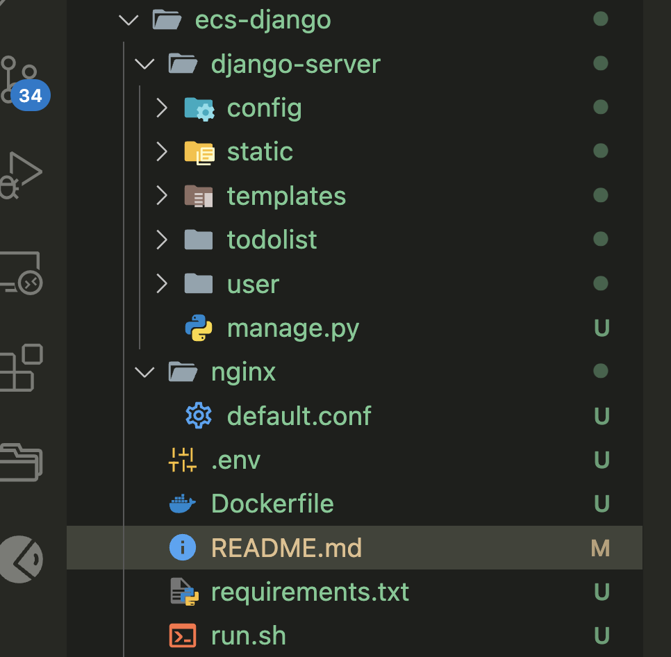
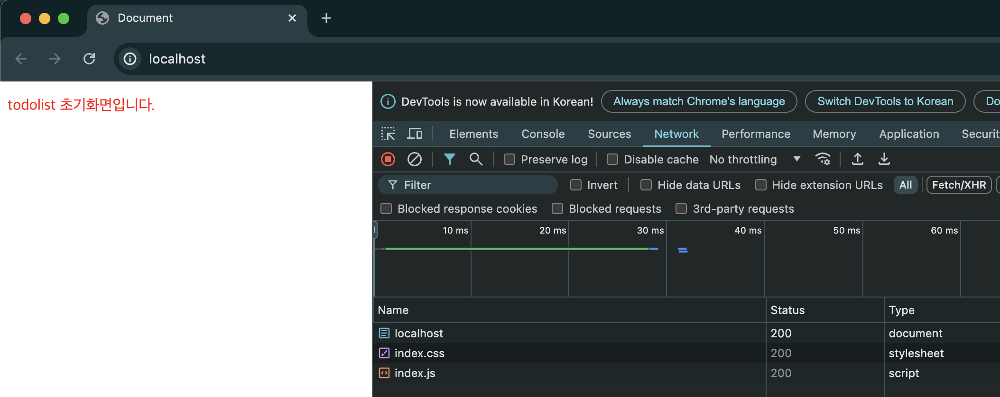
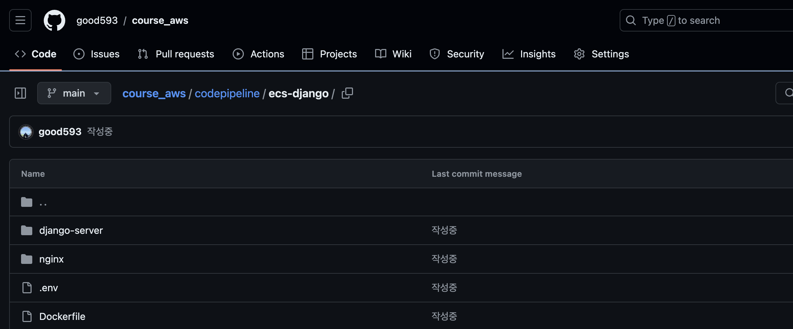

# Github

---
### 단계1: django with nginx
- 참고문서: `ec2/4-1. ec2 - django/1. django on docker.md`



---
### 단계2: Make docker image
- 명령어: `docker build --platform linux/amd64 -t [이미지명] .`
```shell
# Make docker image
docker build --platform linux/amd64 -t django-image .
```

### 단계3: Create container
- 명령어: `docker run --name [컨테이너명] -d -p 80:80  [이미지명]`
```shell
# Create container
docker run --name django-container -d -p 80:80 django-image
```

---
### 단계4: Django 접속 테스트
- `http://localhost:80/`



---
### 단계5: push to Github & 확인 

