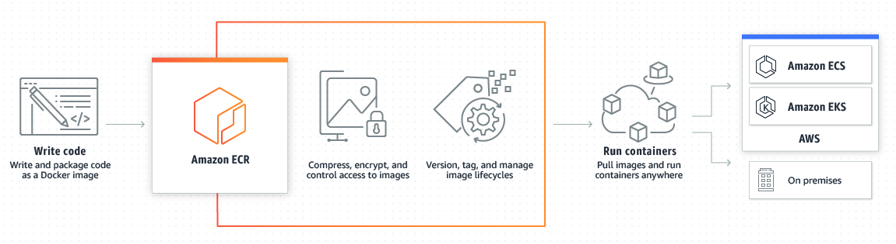
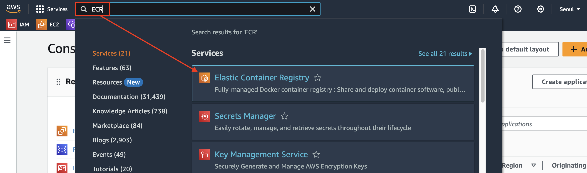
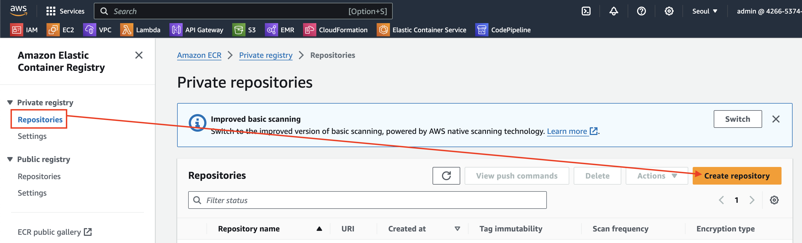
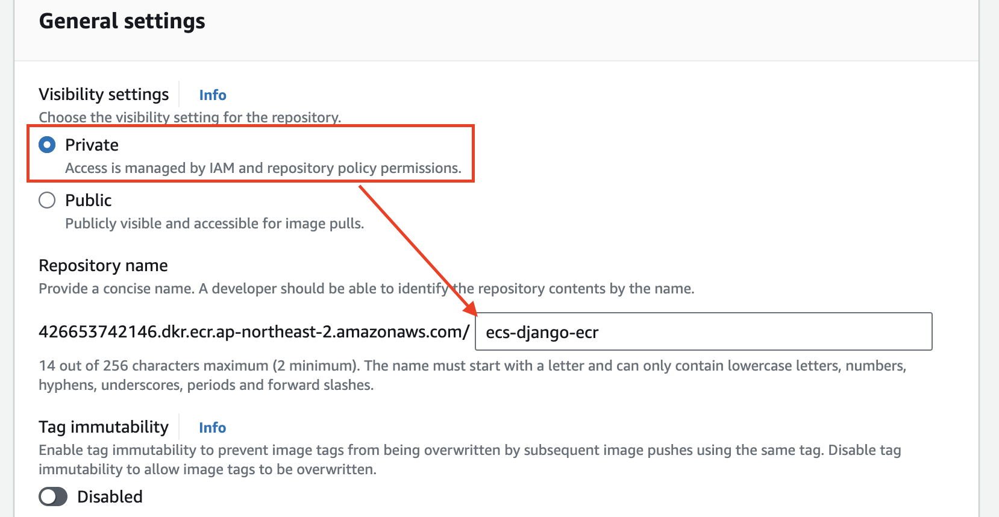
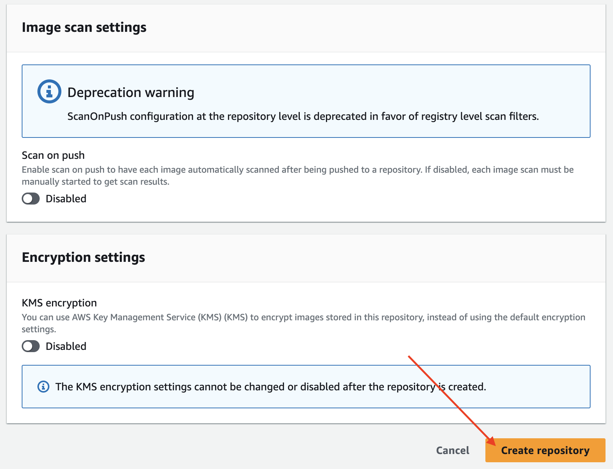
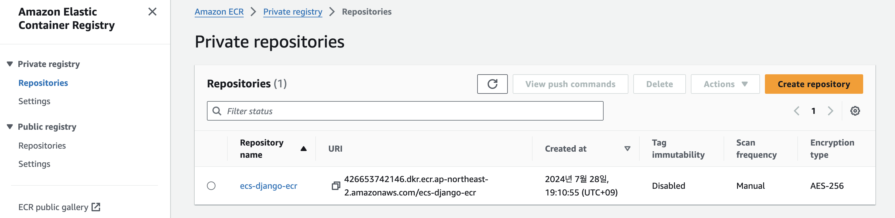

# [Amazon Elastic Container Registry](https://aws.amazon.com/ko/ecr/)
- Amazon Elastic Container Registry(Amazon ECR)는 어디서나 애플리케이션 이미지 및 아티팩트를 안정적으로 배포할 수 있도록 뛰어난 성능 호스팅을 제공하는 완전관리형 컨테이너 레지스트리입니다.

---
### 단계1: ECR 접속  

---
### 단계2: Create repository

---
### 단계3: Create repository > General settings

---
### 단계4: Create repository > 생성

---
### 단계5: 결과 확인  

