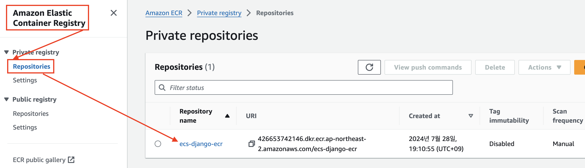

# [AWS CodeBuild](https://aws.amazon.com/ko/codebuild/)
- AWS CodeBuild는 소스 코드를 컴파일하고 테스트를 실행한 다음 바로 배포 가능한 소프트웨어 패키지를 생성할 수 있는 완전관리형의 지속적 통합 서비스입니다.


---
### 단계1: buildspec.yml 생성


---
- 생성한 aws ecr 적용  
```yml
version: 0.2
env:
  git-credential-helper: yes
  variables:
    # docker 파라미터 정의
    ECS_CONTAINER_NAME: ecs-django-container
    IMAGE_REPO_NAME: ecs-django-ecr # aws ecr에 등록이 되어 있는 name
    IMAGE_TAG: latest
    AWS_DEFAULT_REGION: ap-northeast-2

...
```
---
- Github Repository에 있는 Dockerfile의 위치에 맞춰 수정
```yml
...

  build:
    commands:
      - echo Build started on `date`
      - echo Building the Docker image...
      # Github Repository에 있는 Dockerfile의 위치에 맞춰 수정 
      - docker build -f ./codepipeline/ecs-django/Dockerfile -t $IMAGE_REPO_NAME:$IMAGE_TAG .
      - docker tag $IMAGE_REPO_NAME:$IMAGE_TAG $REPOSITORY_URI

...
```
---
### 단계2: AWS CodePipeline


---
### 단계3: Create connection


---
### 단계4: Connect to GitHub


---
### 단계5: Connect


---
### 단계6: 결과 확인 


---
### 단계7: Create build project


---
### 단계8: Create build project > Project configuration


---
### 단계9: Create build project > Source


---
### 단계9: Create build project > Environment


---
### 단계10: Create build project > Buildspec
- Github에 저장된 buildspec.yml 위치 작성 


---
### 단계11: Create build project 클릭 


---
### 단계12: IAM 접속 


---
### 단계13: 생성한 codebuild role 선택 


---
### 단계14: Attach policies


---
### 단계15: add Permission
- codebuild에 ECR 접속 권한 추가 
```shell
AmazonEC2ContainerRegistryPowerUser
```


---
### 단계16: 결과 확인  


---
### 단계17: AWS CodeBuild > Start build


---
### 단계18: Start build > Succeeded


---
### 단계19: AWS ECR > ecs-django-ecr 클릭


---
### 단계20: 결과 확인 
- CodeBuild를 통해 이미지가 등록됨 


