# Architecture


---
# [Parameter Store](https://docs.aws.amazon.com/ko_kr/systems-manager/latest/userguide/systems-manager-parameter-store.html)
- AWS Systems Manager의 기능인 Parameter Store는 구성 데이터 관리 및 암호 관리를 위한 안전한 계층적 스토리지를 제공합니다. 
- 암호, 데이터베이스 문자열, Amazon Machine Image(AMI) ID, 라이선스 코드와 같은 데이터를 파라미터 값으로 저장할 수 있습니다.

---
## 파라미터 스토어의 특징
- 무료다.
- 키-값 쌍으로 값을 저장한다.
- AWS Key Management Service(KMS)를 이용해 암호화된 값을 저장할 수 있다.
- SecureString 파라미터 생성 시 Parameter Store에서 비용이 부과되지 않지만 `AWS Key Management Service(KMS)` 암호화 사용에 대한 [요금]((https://aws.amazon.com/kms/pricing/))이 적용됩니다.
- [IAM을 이용해 일부 사용자만 접근할 수 있도록 설정할 수 있다.](https://docs.aws.amazon.com/ko_kr/systems-manager/latest/userguide/sysman-paramstore-access.html)
- 값에 대한 변경 이력까지 저장하고 있다.

---
## [파라미터 생성시 제약조건](https://docs.aws.amazon.com/ko_kr/systems-manager/latest/userguide/sysman-paramstore-su-create.html)
- `대/소문자 구분`: 파라미터 이름은 대/소문자를 구분합니다.
- `공백`: 파라미터 이름에는 공백이 포함될 수 없습니다.
- `유효한 값`: 파라미터 이름은 a-zA-Z0-9_.-과 같은 기호와 문자로 구성될 수 있습니다.
  - 또한 슬래시 문자(/)는 파라미터 이름의 계층 구조를 나타내는 데 사용됩니다. `예: /Dev/Production/East/Project-ABC/MyParameter`
- `길이`: 생성할 수 있는 파라미터 이름의 최대 길이는 1011자입니다. 
  - 여기에는 arn:aws:ssm:us-east-2:111122223333:parameter/와 같이 지정한 이름 앞에 오는 ARN의 문자가 포함됩니다.

---
## 파라미터 생성하기 
### 단계1: [파라미터 스토어 생성](https://ap-northeast-2.console.aws.amazon.com/systems-manager/parameters?region=ap-northeast-2)
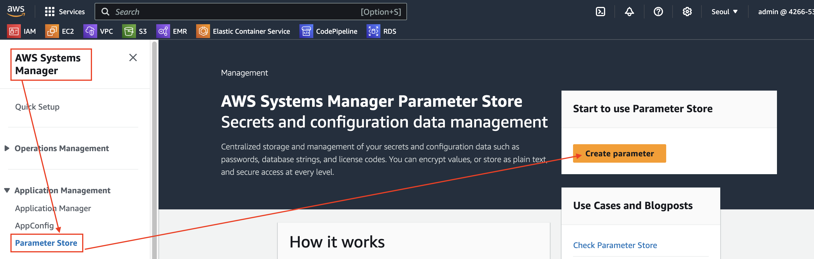

---
### 단계2: 파라미터 이름
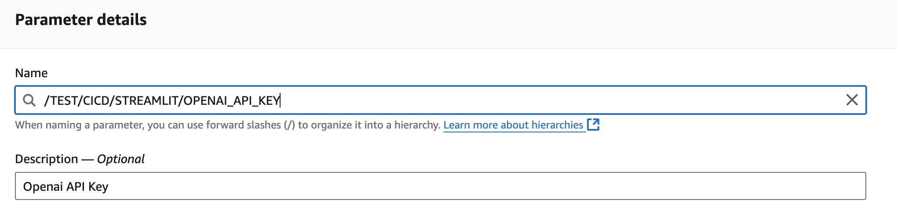

---
### 단계3: Tier > Standard 선택
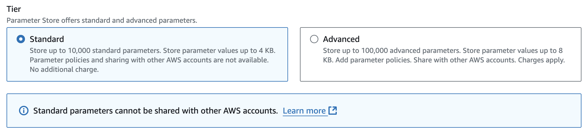

---
### 단계4: 파라미터 타입 선택 
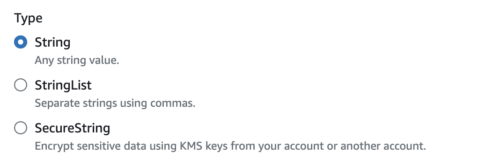

---
### 단계5: [Openai API Key 생성 및 복사](https://platform.openai.com/api-keys)
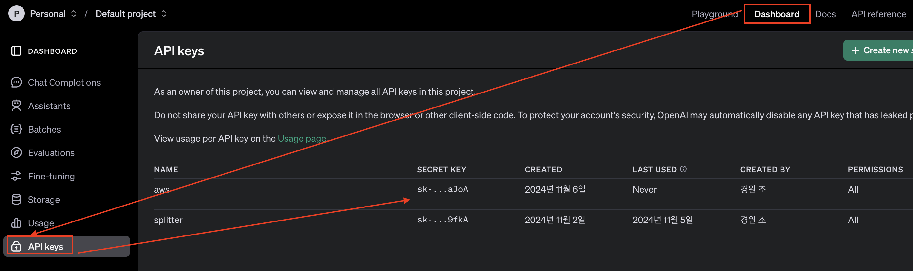

---
### 단계6: Openai API Key 붙여넣기
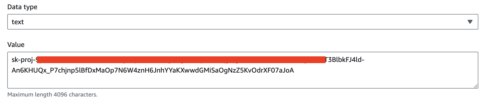

---
### 단계7: Create parameter
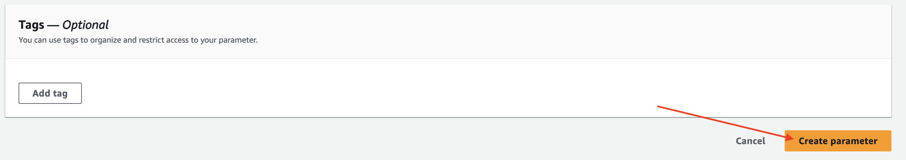

---
### 단계8: 파라미터 생성 확인 
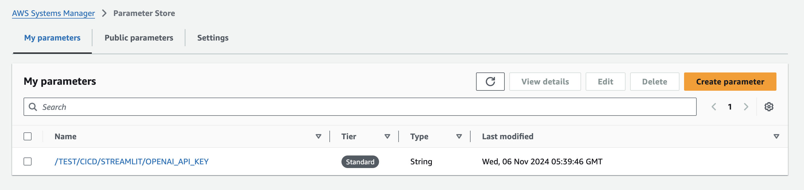

---
### 단계9: CLI에서 파라미터 생성 확인 
```shell
$ aws ssm get-parameter --name /TEST/CICD/STREAMLIT/OPENAI_API_KEY
```
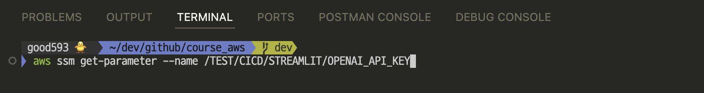
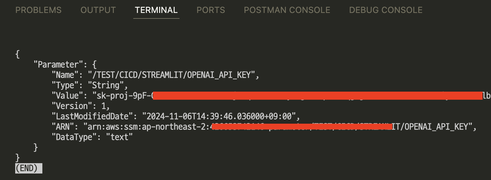

---
### 단계10: Python에서 파라미터 생성 확인 
```python
import boto3

ssm = boto3.client('ssm')
parameter = ssm.get_parameter(Name='/TEST/CICD/STREAMLIT/OPENAI_API_KEY', WithDecryption=True)
print(parameter['Parameter']['Value'])
```
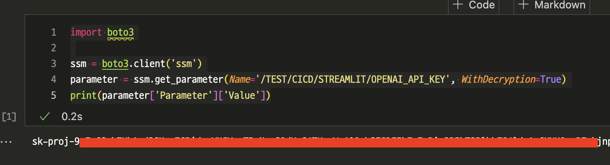


