# CodePipeline 삭제 

---
### 단계1: CodePipeline
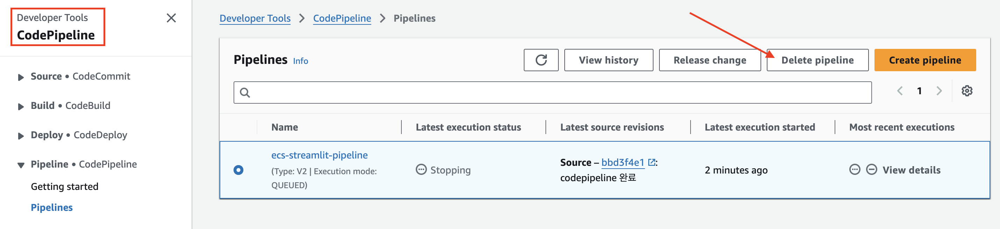

---
### 단계2: Codebuild
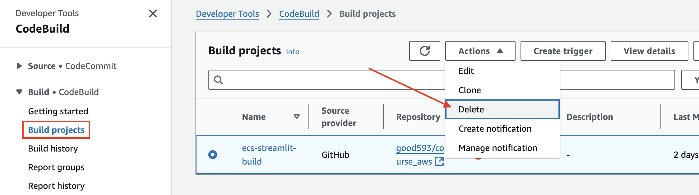

---
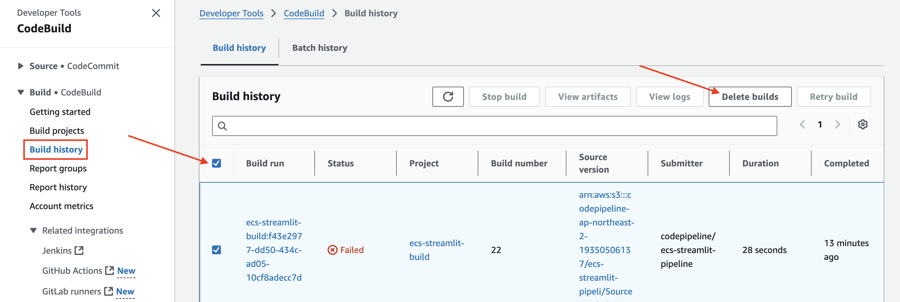

---
### 단계3: Connections
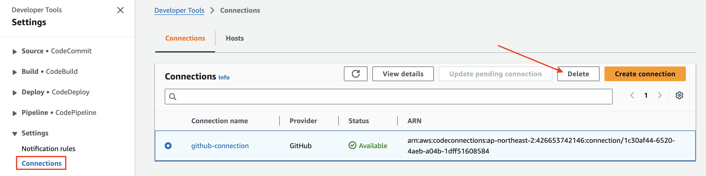

---
# ECS 삭제 

---
### 단계1: Service
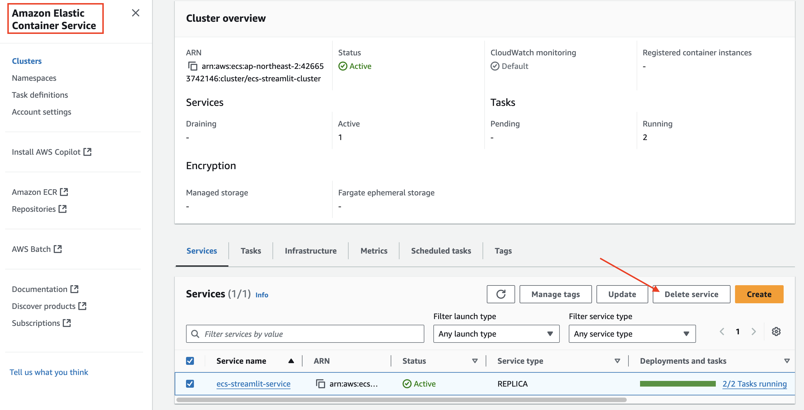

---
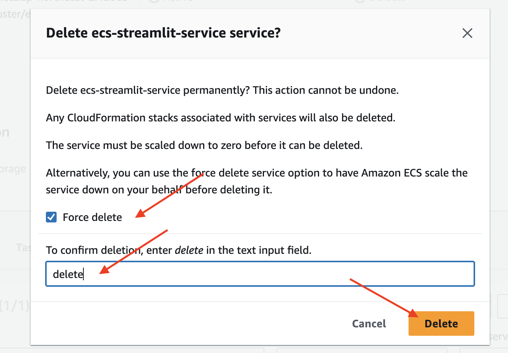

---
### 단계2: Cluster
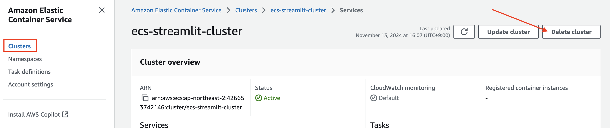

---
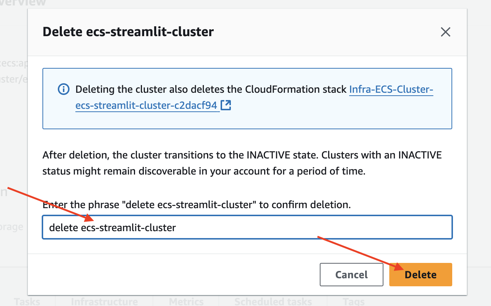

---
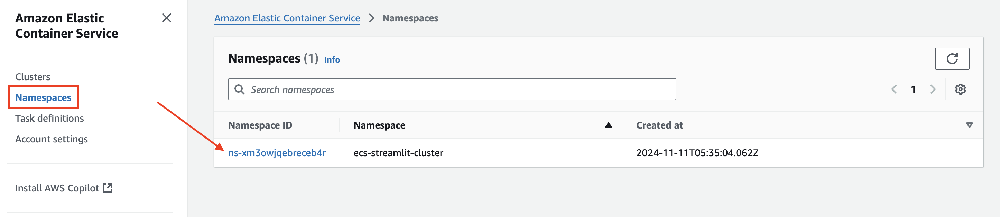

---
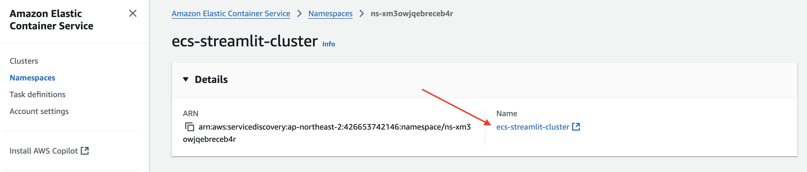

---
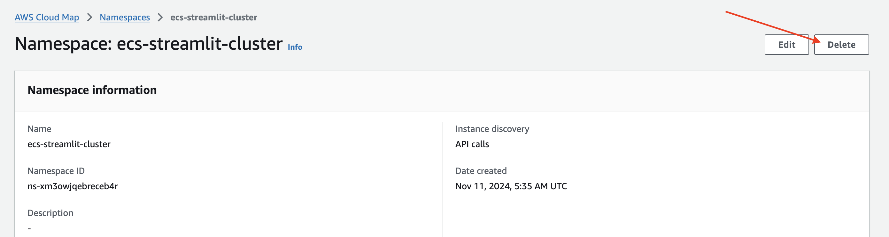

---
### 단계3: Task definitions
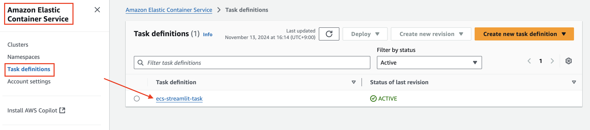

---
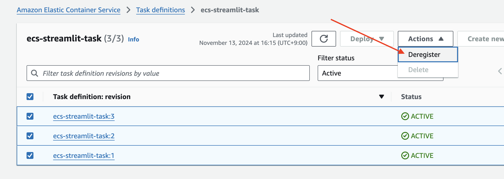

---
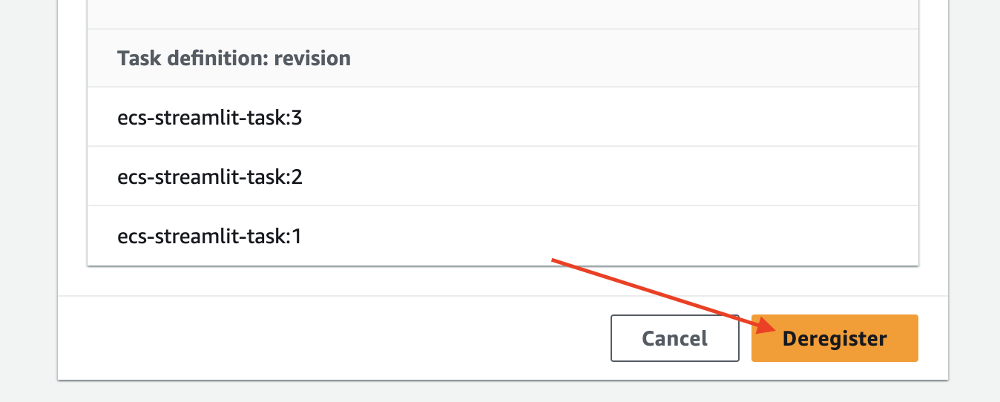

---
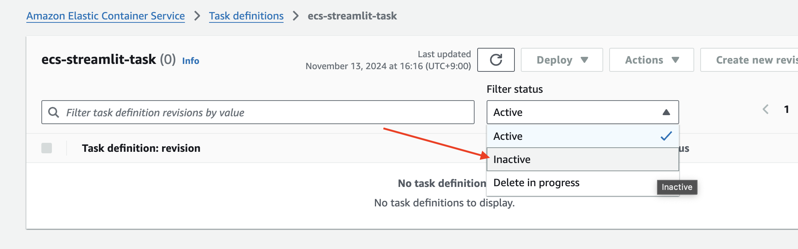

---
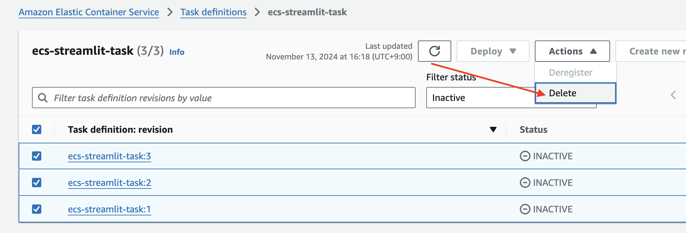

---
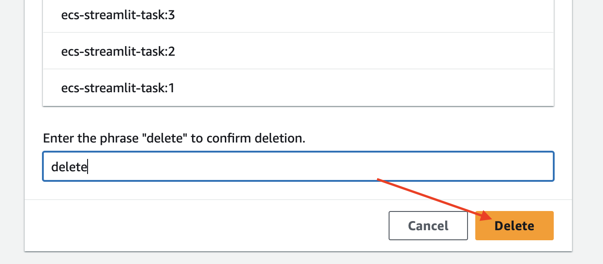

---
# ALB 삭제 

---
### 단계1: Load balancers 
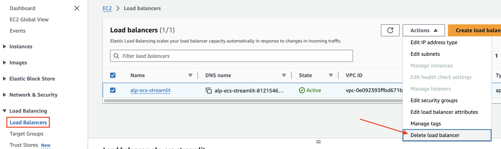

---
### 단계2: Target groups 
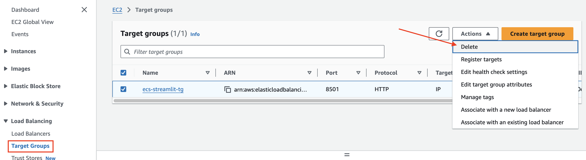

---
# SSL/TLS 인증서 삭제 

---
### 단계1: Certificates
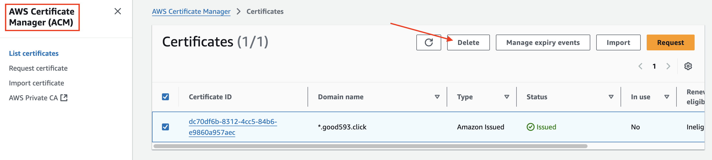

---
### 단계2: Hosted zones
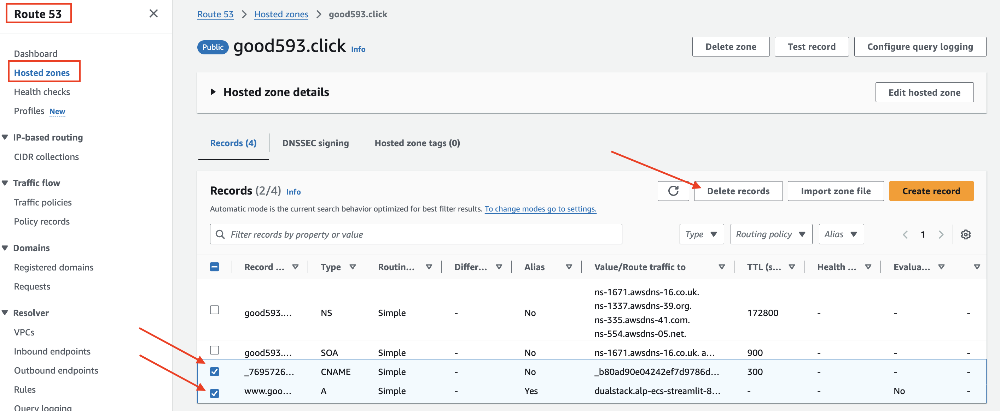

---
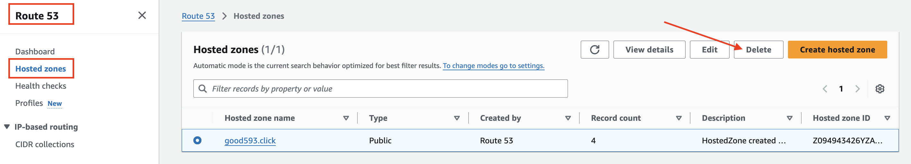

---
# IAM Role 삭제 
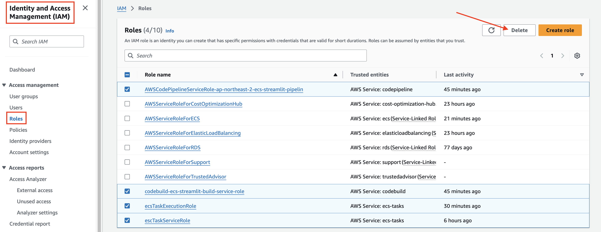

---
# 참고
- Parameter Store 삭제 생략 
- DNS 삭제 생략 

