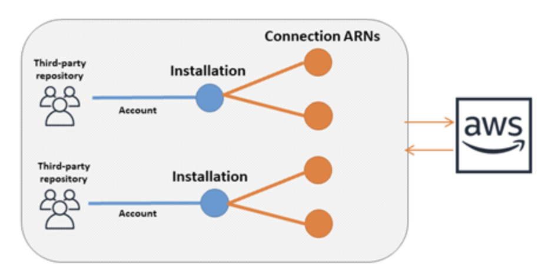
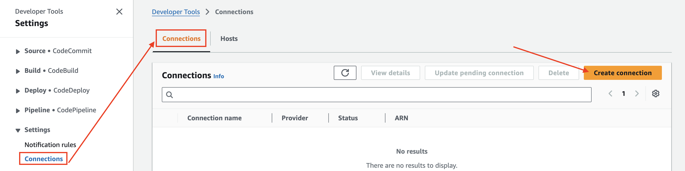
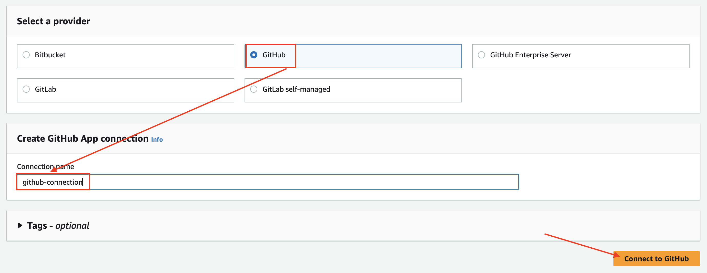
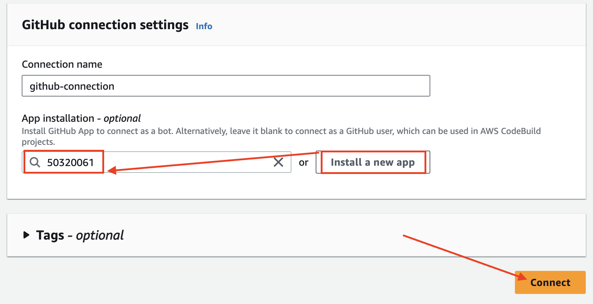
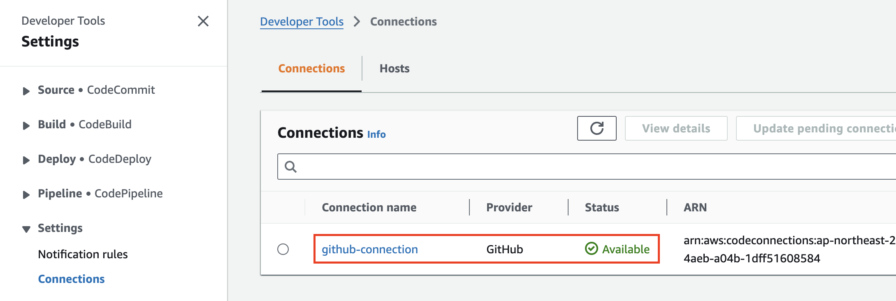

# Architecture

---
# [Code Connections](https://docs.aws.amazon.com/dtconsole/latest/userguide/welcome-connections.html)
- AWS CodeConnections는 GitHub, GitLab 및 Bitbucket과 같은 타사 Git 기반 소스 공급자와 통합되며, AWS CodePipeline, Amazon CodeWhisperer 및 AWS CloudFormation과 같은 AWS 서비스가 리포지토리 이벤트에 대한 알림을 받고 소스 코드를 다운로드하여 코드를 구축, 테스트 및 배포할 수 있도록 합니다.

---
### 단계1: CodePipeline 접속 

---
### 단계2: Create connection

---
### 단계3: Connect to GitHub

---
### 단계4: GitHub connection settings

---
### 단계5: 생성된 결과 확인  
- 상태값이 `Available`이어야만 함 

