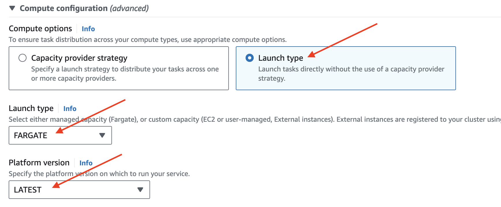
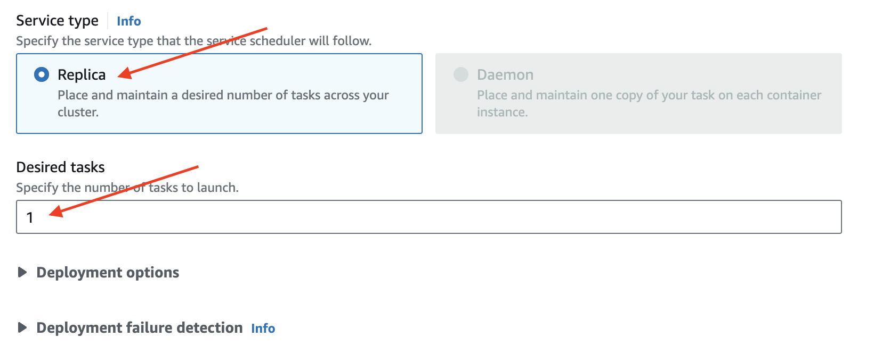
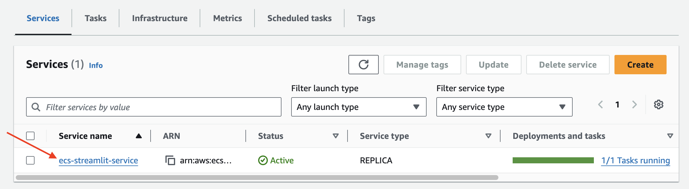
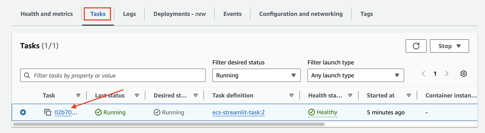

# Architecture


---
# [Amazon Elastic Container Service](https://aws.amazon.com/ko/ecs/)
- Amazon Elastic Container Service(ECS)는 컨테이너화된 애플리케이션이 더 효율적으로 배포하고 관리하고 규모를 조정하는 데 도움이 되는 완전관리형 컨테이너 오케스트레이션 서비스입니다. 


---
## [escTaskServiceRole 생성](https://docs.aws.amazon.com/ko_kr/kms/latest/developerguide/services-parameter-store.html)
- ECS Task에서 Parameter Store에 접속 및 조회 권한 추가 

---
### 단계1: IAM 접속 


---
### 단계2: Create Role 


---
### 단계3: Trusted entity type


---
### 단계4: Use case


---
### 단계5: Add AmazonSSMReadOnlyAccess 


---
### 단계6: Role details


---
### 단계7: Create


---
- 생성된 Role 확인 


---
## Cluster

---
### 단계1: ECS 접속 


---
### 단계2: Create cluster


---
### 단계3: Create cluster > Cluster configuration


---
### 단계4: Create cluster > Infrastructure


---
### 단계5: Create cluster > Create
> AWS KMS를 사용하는 경우에 세팅(이번 강의에서는 생략)


---
## Task definitions


---
### 단계1: Create new task definition


---
### 단계2: Task definition configuration


---
### 단계3: Infrastructure requirements


---
- Task roles


---
### 단계4: Container
- Container Name: `buildspec.yml`에 정의된 이름 작성!
```yml
version: 0.2
env:
  git-credential-helper: 'yes'
  variables:
    # docker 파라미터 정의
    ECS_CONTAINER_NAME: ecs-streamlit-container
    ...
```


---
- AWS ECR 접속 > URI 복사 


---
- AWS ECS Container > Image URI에 복사한 `ECR URI` 붙여넣기 


---
- AWS ECS Container > Port mappings


---
- AWS ECS Container > HealthCheck
```shell
CMD-SHELL,curl -f http://localhost:8501/_stcore/health || exit 1
```


---
### 단계5: Create


---
- 결과 확인 


---
## Service

---
### 단계1: cluster 선택  


---
### 단계2: Service Create


---
### 단계3: Compute configuration


---
### 단계4: Deployment configuration


---
- `Desired tasks`: 정의된 숫자만큼 instance(django server) 유지 



---
### 단계5: Create


---
- 생성된 결과 확인 


---
## ECS > streamlit servier 접속 

---
### 단계1: EC2 접속 


---
### 단계2: Edit inbound rules


---
### 단계3: add streamlit port 


---
- 결과 확인 


---
### 단계4: ECS Cluster 접속 


---
### 단계5: ECS Service 접속 


---
### 단계6: ECS Task 접속 


---
### 단계7: Public IP copied


---
### 단계8: 접속 > Public IP:8501


