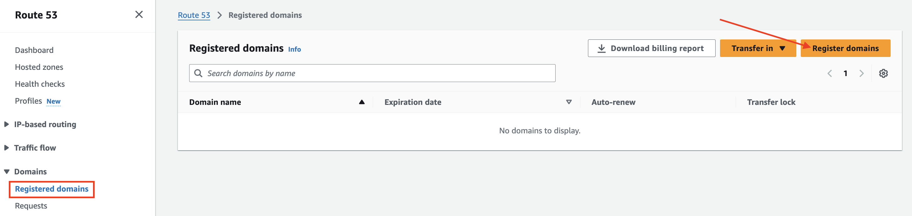

# Architecture

---
# [Domain Name System](https://www.akamai.com/ko/glossary/what-are-dns-servers)
- `DNS` 또는 `Domain Name System`은 사람이 읽을 수 있는 도메인 이름(예: www.amazon.com)을 머신이 읽을 수 있는 IP 주소(예: 192.0.2.44)로 변환합니다.

---
# [Route 53](https://aws.amazon.com/ko/route53/)
- Amazon Route 53는 가용성과 확장성이 뛰어난 `도메인 이름 시스템(DNS)` 웹 서비스입니다. 
- Route 53는 사용자 요청을 AWS 또는 온프레미스에서 실행되는 인터넷 애플리케이션에 연결합니다.
- [Route 53 요금](https://aws.amazon.com/ko/route53/pricing/)

---
## [DNS 도메인 생성](https://aws.amazon.com/ko/getting-started/hands-on/get-a-domain/)

---
### 단계1: Route 53 접속 

---
### 단계2: Register domains

---
### 단계3: Check Price > Check availability for a domain

---
### 단계4: Select a domain

---
### 단계5: Proceed to checkout

---
### 단계6: Domain pricing options

---
### 단계7: Registrant contact

---
### 단계8: Next

---
### 단계9: Submit

---
### 단계10: 도메인 등록 상태 보기

---
### 단계11: 도메인 등록 완료 확인 

---
### 단계12: Hosted zones 

---
### 단계13: [NameServer 확인](https://inpa.tistory.com/entry/AWS-%F0%9F%93%9A-Route-53-%EA%B0%9C%EB%85%90-%EC%9B%90%EB%A6%AC-%EC%82%AC%EC%9A%A9-%EC%84%B8%ED%8C%85-%F0%9F%92%AF-%EC%A0%95%EB%A6%AC) 

---
NS
- 네임서버 레코드로 도메인에 대한 네임서버의 권한을 가지고 있는지 알려주는 레코드
- 예를 들어 naver.com의 NS레코드는 e-ns.naver.com, ns1.naver.com, ns2.naver.com 이다.

SOA
- 도메인의 정보를 가지고 있는 레코드.
- naver의 경우 ns1.naver.com webmaster.naver.com 2021012809 21600 1800 1209600 180 이렇게 보여주고 있는데,
- 각각 마스터 네임서버, 존 관리자 연락처, 존 데이터 동기화 시간, 갱신주기, 시도, 만료 등 정보를 나타내고 있다.

---
## (옵션) 기존 DNS 적용 

---
### 단계1: Create hosted zone

---
### 단계2: Domzin name > 기존 DNS 작성 

---

---
### 단계3: 결과 확인  

---
# [ECS와 DNS 연결](https://aws.amazon.com/ko/getting-started/hands-on/get-a-domain/)

---
## [DNS 레코드](https://inpa.tistory.com/entry/WEB-%F0%9F%8C%90-DNS-%EB%A0%88%EC%BD%94%EB%93%9C-%EC%A2%85%EB%A5%98-%E2%98%85-%EC%95%8C%EA%B8%B0-%EC%89%BD%EA%B2%8C-%EC%A0%95%EB%A6%AC)
- DNS Record는 DNS 서버가 해당 패킷을 받았을 때 어떤식으로 처리할지를 나타내는 지침을 말한다.
- 간단히 말하면 DNS 상에서 도메인에 관한 설정을 하기 위해 사용되는 일련의 설정 문자라고 보면 된다.
- DNS 레코드에는 서버가 요청에 응답하는 방법에 대한 다양한 구문과 명령이 포함되어 있다. 

---
### 단계1: ECS의 Public IP 복사 

---
### 단계2: Create record

---
### 단계3: DNS 레코드 생성 
- `Record name(레코드 이름)`: 라우팅할 이름을 지정, 지정하지 않으면 기본 도메인 이름이 설정된다.  예를 들어 www 만 입력하게되면 www.recordname.com 의 도메인이 라우팅 된다.
- `Record type(레코드 유형)`: DNS 레코드를 선택하는 항목이다. ec2로 라우팅 시 ipv4 로 라우팅하기때문에 건들지 않는다.
- `Value(값)`: 라우팅 할 ec2의 ipv4 를 입력. 다른 AWS 리소스로 라우팅이 가능한 유형의 경우 별칭을 체크하면 라우팅 가능한 서비스를 선택할 수 있다.
- `TTL`: DNS에 ip주소를 저장할 시간(초), health check 기능을 사용할 경우 AWS에서는 60초 이하를 권장한다. 
- `Routing policy(라우팅 정책)`: 트래픽에 대한 라우팅방법 선택.

---

---
### 단계4: DNS를 이용한 Streamlit 접속 
 

---
> DNS:8501

