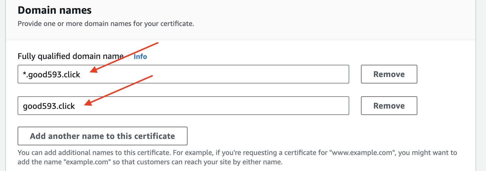

# Architecture

---
# [SSL/TLS 인증서](https://aws.amazon.com/ko/what-is/ssl-certificate/)
- SSL/TLS 인증서는 웹 사이트 사용자 간에 신뢰 관계를 설정합니다. 
- 기업은 웹 서버에 SSL/TLS 인증서를 설치하여 SSL/TLS 보안 웹 사이트를 만듭니다.

---
## SSL/TLS 인증서가 중요한 이유
개인 데이터 보호
- 브라우저는 웹 사이트의 SSL/TLS 인증서를 확인하여 웹 사이트 서버와의 보안 연결을 시작하고 유지합니다.

고객 신뢰 강화
- SSL/TLS 보호를 통해 고객은 데이터를 비즈니스와 공유할 때 데이터가 보호되고 있음을 알 수 있습니다.

규제 준수 지원
- PCI DSS는 SSL/TLS 인증서로 웹 서버를 보호하는 것을 포함하여 안전한 온라인 트랜잭션을 제공하기 위한 업계 요구 사항입니다. 

SEO 개선
- SSL/TLS 보안 웹 사이트는 SSL/TLS 인증서가 없는 유사한 웹 사이트보다 검색 엔진에서 더 높은 순위를 차지할 것입니다. 
  
---
# [AWS Certificate Manager](https://docs.aws.amazon.com/ko_kr/acm/latest/userguide/acm-overview.html)

---
### 단계1: Certificate Manager 접속

---
### 단계2: Request certificate

---
### 단계3: Certificate type 

---
### 단계4: Domain names
- 본인이 SSL을 설치하고자 하는 도메인을 등록합니다. (여기서 도메인을 사는건 아닙니다.)
- 아래와 같이 *.aaa.com 식으로 등록하면 *로 인해 하위 도메인들이 모두 사용할 수 있는 인증서가 됩니다. (www.aaa.com, admin.aaa.com 등등이 하위 도메인입니다.)

---
### 단계5: Validation method 

---
### 단계6: Request

---
### 단계7: Pending validation(검증보류) > 선택

---
### 단계8: Create records in Route 53

---

---
### 단계9: 생성확인 > Route 53

---
### 단계10: 생성확인 > ACM

