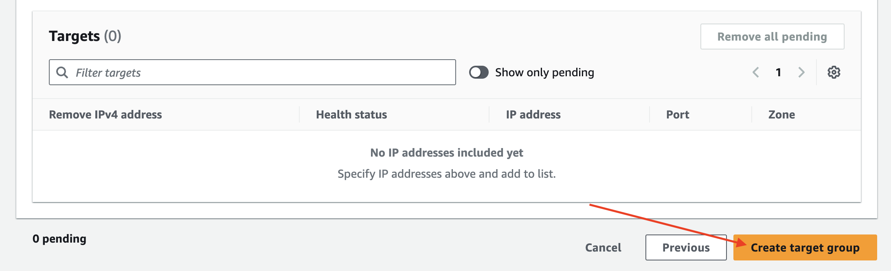
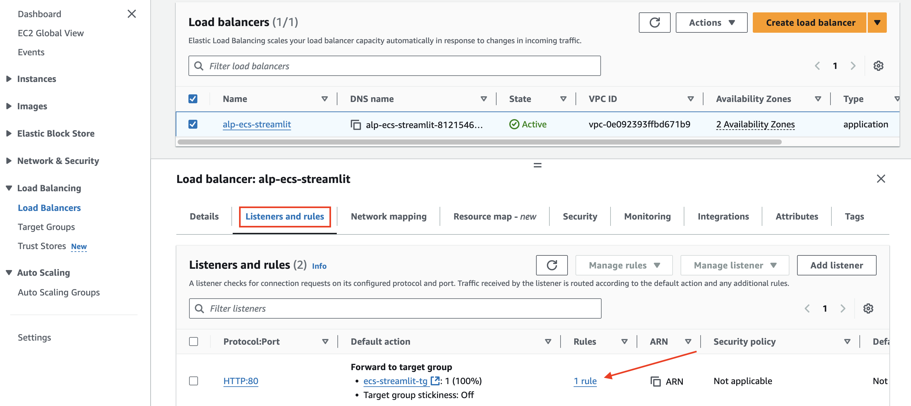

# Architecture

---
# [ELB (Elastic Load Balancing)](https://jibinary.tistory.com/196)
- ELB는 하나 이상의 가용 영역(AZ)에 있는 애플리케이션에게 들어오는 트래픽을 자동으로 분산한다.
- ELB는 AWS의 로드 밸런스 종류 전체를 통틀어 칭하는 말이다.

---
## ELB 의 특징/기능
- 애플리케이션의 가용성(High Availability)과 확장성(Auto Scaling)을 향상시킨다.
- ELB는 EC2뿐만 아니라 ECS, Lambda 등 다양한 서비스와 연계하여 트레픽 부하를 분배 할 수 있다.
- [Slow Start Configuration, 느린 시작 구성]: 새로 시작된 서버를 위해 천천히 트래픽을 부하 
  - ALB와 NLB만 지원한다
  - Slow Start Configuration은 새로운 인스턴스가 부하가 걸리기 전에 천천히 트래픽을 수신하게 만드는 기능이다.
  - 이 방식은 서버가 처음부터 갑자기 모든 트래픽을 받는 것을 방지하고, 서버가 정상적으로 작동할 수 있도록 점진적으로 트래픽을 분배한다.

---
- [Health Checks] 기능:
  - 서버의 상태를 정기적으로 확인하고, 문제가 있을 경우 트래픽을 해당 서버로 전송하지 않는다.

  

---
- [Connection Draining] 기능: Unhealthy 됐을 때 지정된 시간만큼 연결을 기다려준다 
  - 기본(Default)으로 켜져있다. ALB(와 CLB)만 지원한다
  - 서버에 오류가 발생했을 때, 다른 서버에 트래픽을 이동시키기 전에 기존 연결을 기다려주는 시간
  - 예시) Connection Draining을 200초로 설정하면, 서버에 오류 생긴 후 200초 동안 그나마 기존 연결을 기다려주고, 다른 서버에 트래픽을 이동한다.

  

---
## ELB 4가지 로드 밸런서
1. Classic Load Balancer (CLB)
  - ELB중에 가장 오래된 서비스. `No 추천!`
  - AWS에서는 신규 생성으로 권장하지 않으며, 기존 사용자에게는 계속 지원중.

2. Application Load Balancer (ALB)
  - ALB는 `L7단의 로드 밸런서`를 지원합니다.
  - ALB는 `HTTP/HTTPS 프로토콜`의 헤더를 보고 적절한 패킷으로 전송합니다.
  - ALB는 IP주소 + 포트번호 + 패킷 내용을 보고 스위칭합니다.
  - ALB는 IP 주소가 변동되기 때문에 Client에서 Access 할 ELB의 DNS Name을 이용해야 합니다.
  - ALB는 L7단을 지원하기 때문에 `SSL 적용`이 가능합니다.

3. Network Load Balancer (NLB)
  - NLB는 `L4단의 로드 밸런서`를 지원합니다.
  - NLB는 `TCP/IP 프로토콜`의 헤더를 보고 적절한 패킷으로 전송합니다.
  - NLB는 IP + 포트번호를 보고 스위칭합니다.
  - NLB는 할당한 `Elastic IP를 Static IP로 사용이 가능`하여 DNS Name과 IP주소 모두 사용이 가능합니다.
  - NLB는 `SSL 적용이 인프라 단에서 불가능`하여 애플리케이션에서 따로 적용해 주어야 합니다.

---
# [AWS ALB 구현](https://docs.aws.amazon.com/ko_kr/elasticloadbalancing/latest/application/introduction.html)
- (ALB에서만 사용 가능) Listener Rules는 수신한 요청을 어떻게 처리할지에 대한 규칙(Listener Rules)을 설정한 기능이다.
- 헤더 또는 쿼리 문자열의 내용에 따라 요청을 다르게 처리할 수도 있다.
- HTTP로 들어오는 요청을 HTTPS로 리다이렉트 할 수 있다.

---
## Target Group

---
### 단계1: EC2 접속 

---
### 단계2: Create target group

---
### 단계3: Choose a target type

---
### 단계4: Target group name & port

---
### 단계5: VPC & Protocol version

---
### 단계6: Health checks

---
### 단계7: Next

---
### 단계8: Create target group

---
### 단계9: 결과 확인 

---
### 단계10: Registered targets

---
### 단계11: ECS의 target private ip & port 적용 

---

---
## ALB

---
### 단계1: Create load balancer

---
### 단계2: Load balancer types

---
### 단계3: Basic configuration

---
### 단계4: Network mapping 
> Mappings는 두개 이상 선택해줍니다.

---
### 단계5: Security groups

---
### 단계6: Listeners and routing
> 기존에 생성한 target group 선택 

---
> HTTPS도 추가 

---
### 단계7: Secure listener settings
> HTTPS에 대한 생성한 ACM 적용 

---
### 단계8: Optimize with service integrations - optional

---
### 단계9: Create load balancer

---
### 단계10: 결과 확인  

---
### 단계11: HTTP:80 > rule

---
### 단계12: Edit rule

---
### 단계13: Listener details

---

---
### 단계14: Save changes

---
### 단계15: 결과 확인 

---
### 단계16: Route 53 > 레코드 등록/수정 

---

---
### 단계17: 결과 확인 

---
> https://도메인

---
## ECS Service with ALB

---
### 단계1: ECS > 기존 Service 선택 

---
### 단계2: ECS > Service Delete

---
### 단계3: EC2 > Target Groups 확인 
> 시간이 좀 걸림

---
### 단계4: EC2 > 등록된 Target 삭제 

---
### 단계5: ECS > Create Service

---

---

---

---

---

---

---

---
### 단계6: ECS > Service 결과 확인 

---
### 단계7: EC2 > Target Groups 확인  

---

---
### 단계8: https 접속  
> https://도메인

