# Architecture

---
# [AWS CodePipeline](https://aws.amazon.com/ko/codepipeline/)
- AWS CodePipeline은 빠르고 안정적인 애플리케이션 및 인프라 업데이트를 위해 릴리스 파이프라인을 자동화하는 데 도움이 되는 완전관리형의 지속적 전달 서비스입니다.

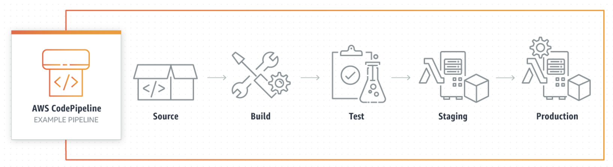

---
## [AWS CodePipeline 요금](https://aws.amazon.com/ko/codepipeline/pricing/?icmpid=docs_console_unmapped)
AWS CodePipeline에는 선결제 금액이나 약정이 없습니다.
- `V1 유형 파이프라인`: 활성 파이프라인 (30일 이상 존재하고 해당 월에 코드 변경이 한 번 이상 실행되는 파이프라인)당 월 1.00 USD가 부과됩니다. 파이프라인 생성 후 처음 30일 동안은 무료입니다.
- `V2 유형 파이프라인`: 작업 실행 분당 0.002 USD가 부과됩니다. 수동 승인 및 사용자 지정 작업 유형을 제외한 모든 작업 유형에 대해 요금이 부과됩니다. 

---
### AWS 프리 티어
CodePipeline은 AWS 프리 티어의 일부로 신규 및 기존 고객에게 다음을 제공합니다.
- `V1 유형 파이프라인`: V1 유형 파이프라인에 대한 매월 1개의 무료 활성 파이프라인
- `V2 유형 파이프라인`: 매월 무료 작업 실행 시간 100분 무료 작업 실행. 사용하지 않은 시간(분)은 다음 달로 이월되지 않습니다.

### 추가 요금
Amazon S3에 파이프라인 아티팩트를 저장하고 액세스하는 경우와 파이프라인에 연결한 기타 AWS 및 서드 파티 서비스에서 작업을 트리거하는 경우 추가 요금이 발생할 수 있습니다.

---
### 단계1: aws pipeline 접속
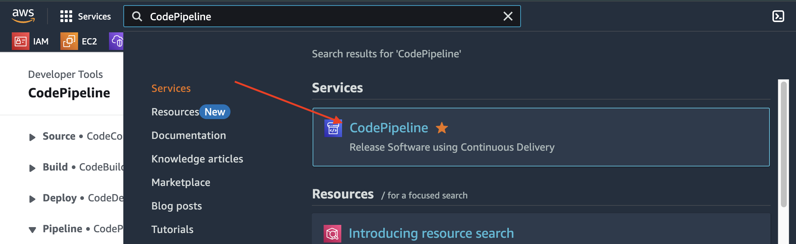

---
### 단계2: Create pipeline
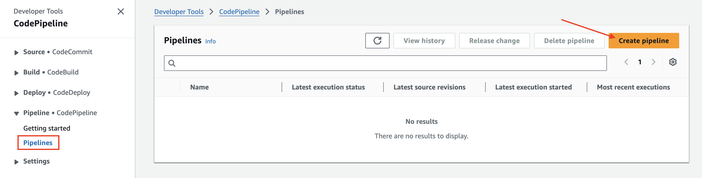

---

---
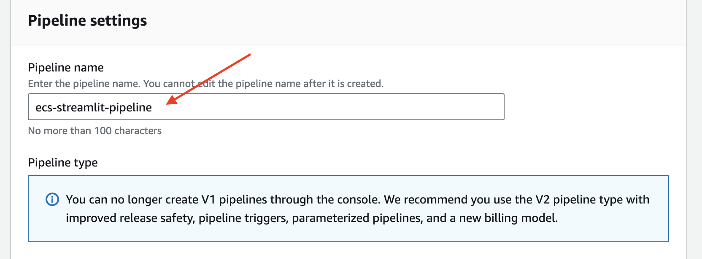

---
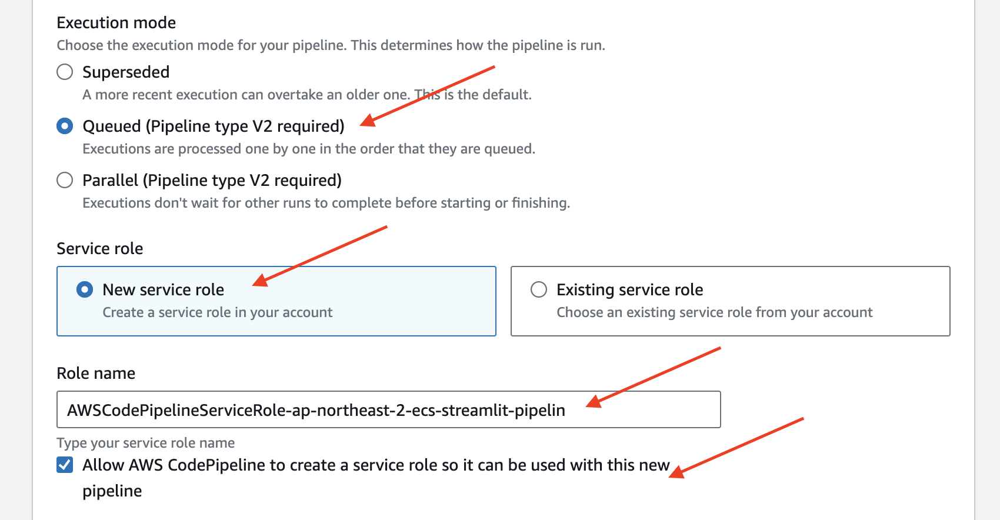

---
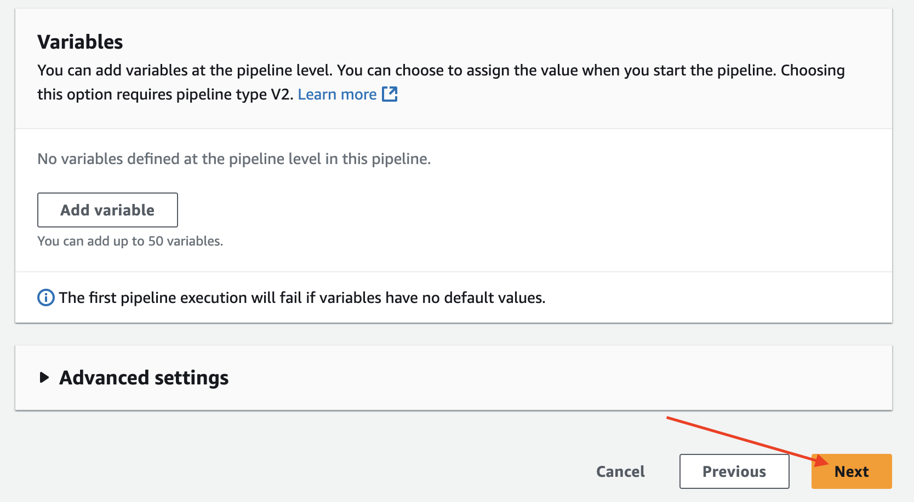

---
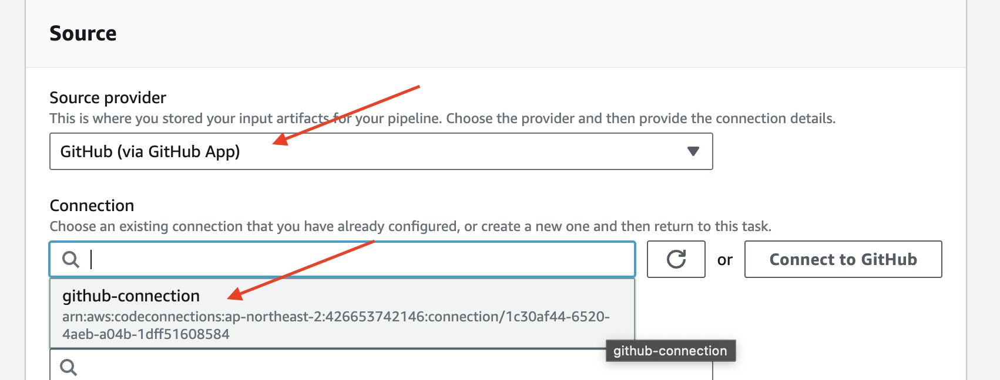

---
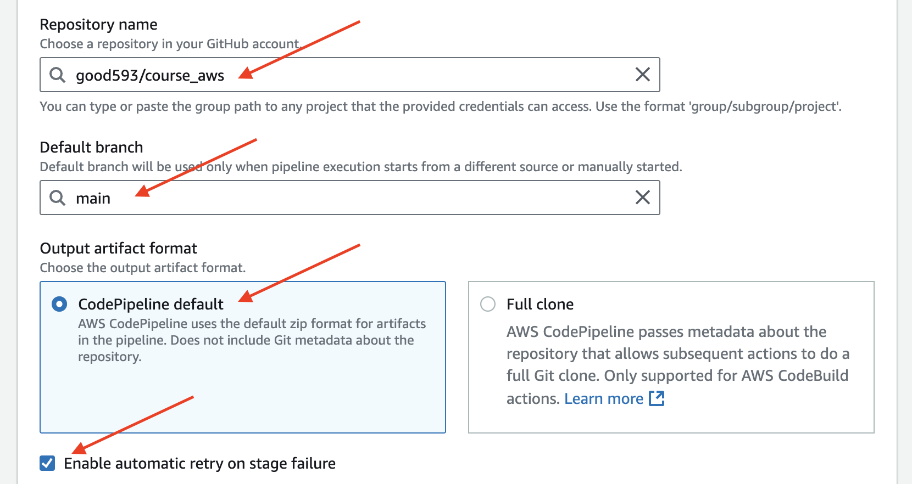

---
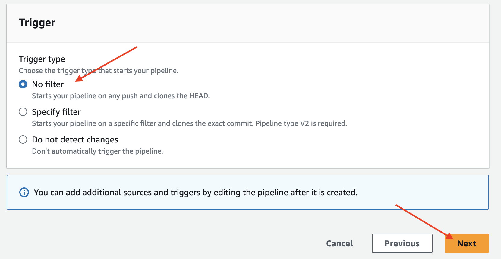

---
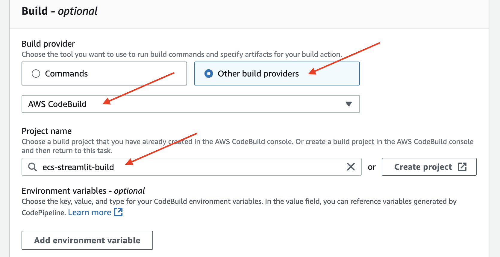

---
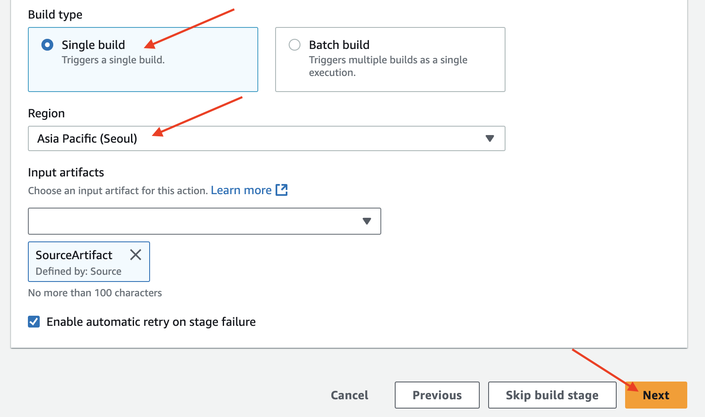

---
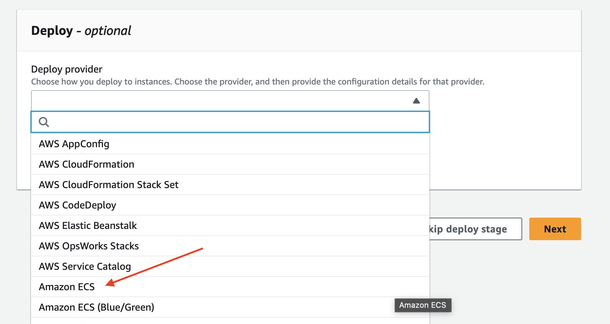

---
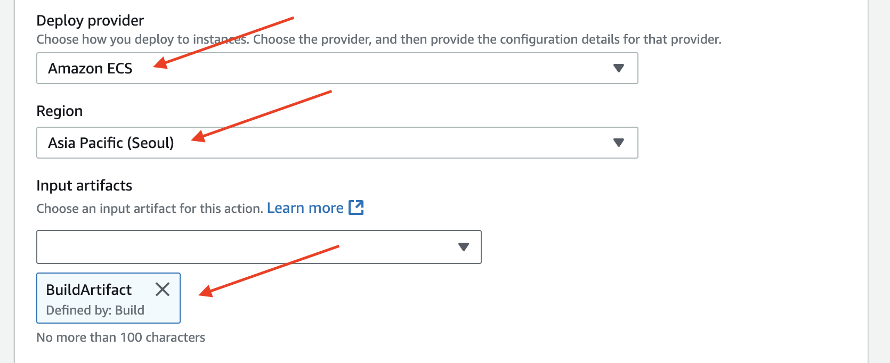

---
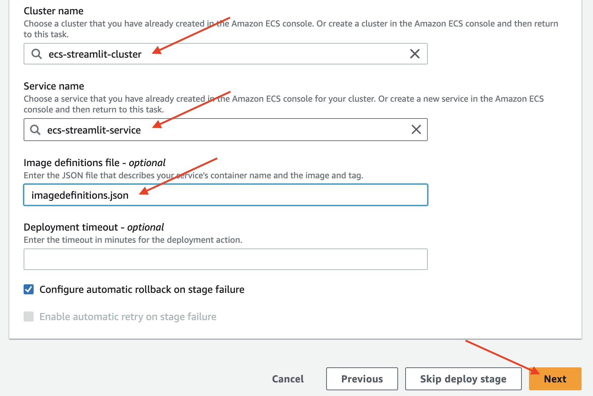

---
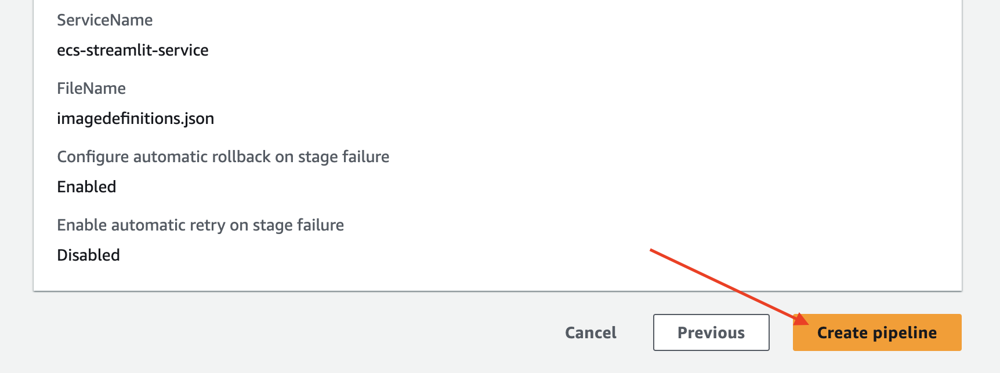

---
### 단계3: CodePipeline 작동성공 
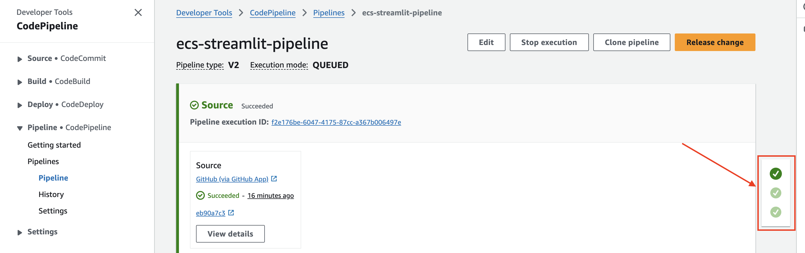

