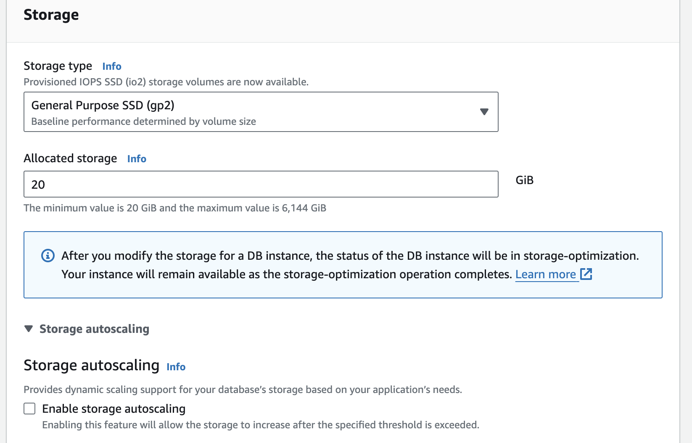
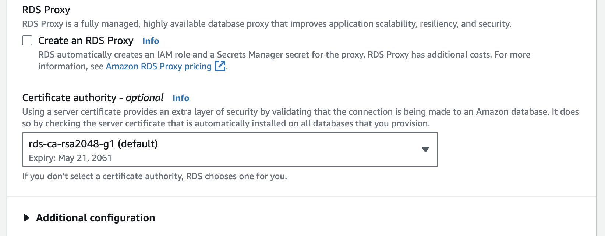

# [AWS MySQL 생성](https://aws.amazon.com/ko/getting-started/hands-on/create-mysql-db/)

---
### 단계1: RDS 접속 

---
### 단계2: Databases > Create Database

---
### 단계3: Choose a database creation method

---
### 단계4: Engine Options > Engine type

---
### 단계5: Engine Options > Engine Version

---
### 단계6: Template

---
### 단계7: Settings > DB instance identifier
- `DB 인스턴스 식별자`: 선택한 리전의 계정에 대해 고유한 DB 인스턴스 이름을 입력합니다. 본 자습서에서는 이름을 rds-mysql-10minTutorial로 지정합니다.

---
### 단계8: Settings > Credentials Settings
- `마스터 사용자 이름`: DB 인스턴스에 로그인할 때 사용할 사용자 이름을 입력합니다. 
- `마스터 암호`: 마스터 사용자 암호에 8~41개의 인쇄용 ASCII 문자(/, " 및 @ 제외)가 포함된 암호를 입력합니다.
- `암호 확인`: 암호를 다시 입력합니다.

---

---
### 단계9: Instance configuration

---
### 단계10: Storage 

---
### 단계11: Connectivity > VPC

---
### 단계12: Connectivity > Public access 
- `퍼블릭 액세스 기능`: 예를 선택합니다. 이렇게 하면 데이터베이스 인스턴스에 대한 IP 주소가 할당되므로 사용자 디바이스에서 데이터베이스에 직접 연결할 수 있습니다.

---
### 단계13: Connectivity > Create Security Group
- `VPC 보안 그룹`: 새 VPC 보안 그룹 생성을 선택합니다. 이렇게 하면 현재 사용하고 있는 디바이스의 IP 주소에서, 생성된 데이터베이스로 연결할 수 있는 보안 그룹이 생성됩니다.

---
### 단계14: Connectivity > RDS Proxy
- `RDS 프록시`: Amazon RDS 프록시를 사용하면 애플리케이션이 데이터베이스 연결을 풀링하고 공유하도록 허용하여 확장 능력을 개선할 수 있습니다. RDS 프록시는 선택하지 않은 상태로 둡니다.

---
### 단계15: Database authentication
- Amazon RDS는 데이터베이스 사용자를 인증하는 여러 가지 방법을 지원합니다. 옵션 목록에서 암호 인증을 선택합니다.

---
### 단계16: Monitoring
- `모니터링 강화`: 프리 티어 범위 내에서 사용하려면 고급 모니터링 활성화를 선택하지 않은 상태로 둡니다. 향상된 모니터링 기능을 활성화하면 DB 인스턴스가 실행되는 운영 체제(OS)에 대한 지표가 실시간으로 제공됩니다. 

---
### 단계17: Additional configuration > Database options
- Initial database name 설정 

---
### 단계18: Additional configuration > Backup

---
### 단계19: Additional configuration > Deletion protection

---
### 단계20: Create database 

---
### 단계21: 생성 완료 > Available

