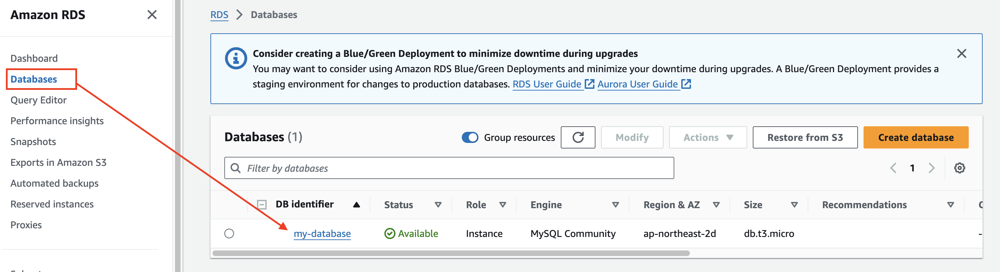
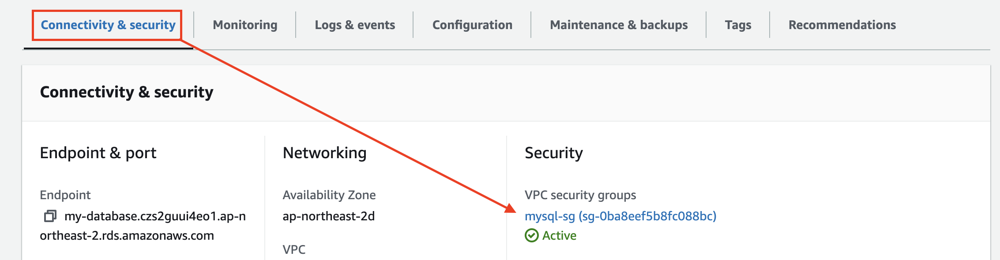
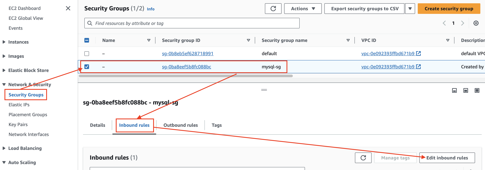
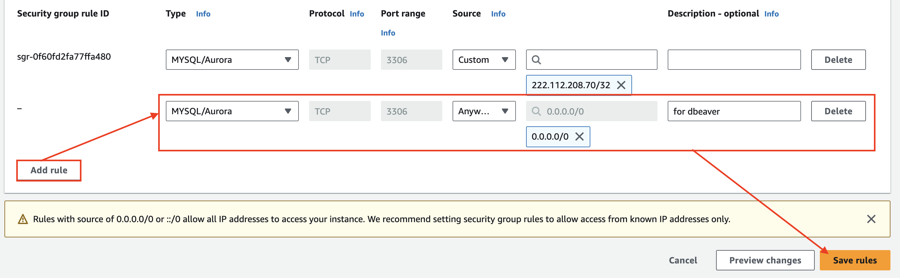
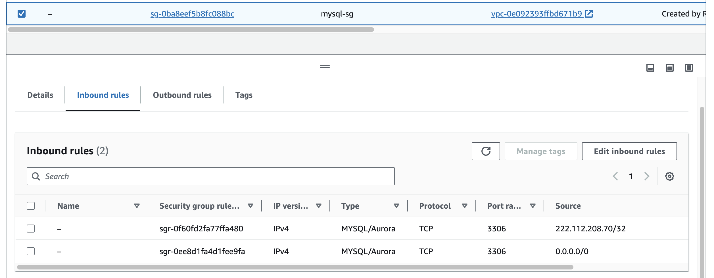

# Security Group 수정 

---
### 단계1: 생성된 MySQL 클릭 

---
### 단계2: 생성된 시큐리티 클릭

---
### 단계3: Inbound rules 수정 

---
### 단계4: Inbound rules 추가 
- 원칙적으로는 측정 IP대역에서만 접속하도록 설정해야함.
- `0.0.0.0/0`: 전세계 어디서든지 접속 가능 

---
### 단계5: 결과 확인  

