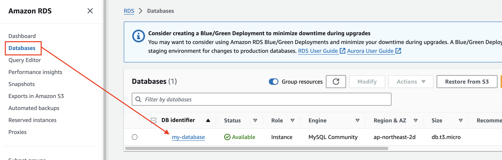
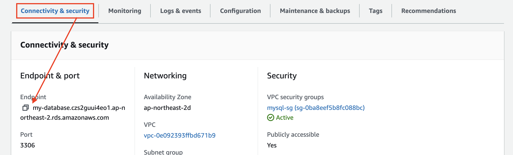
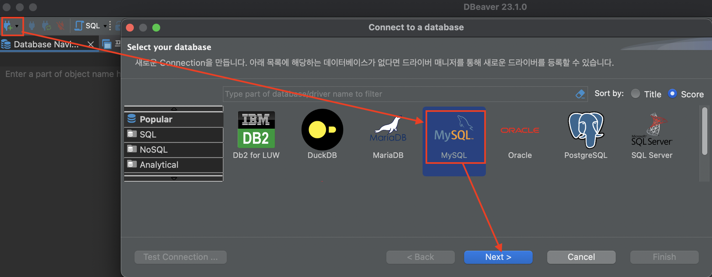
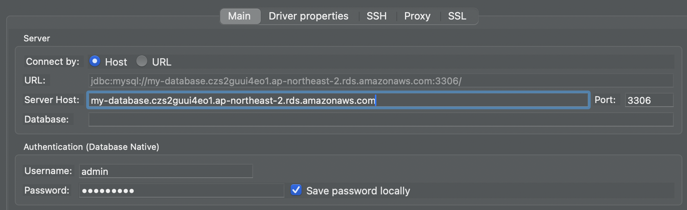
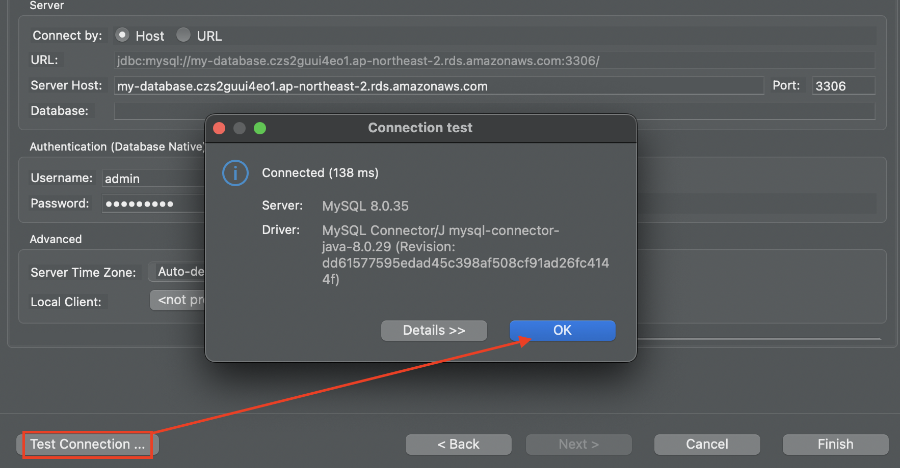
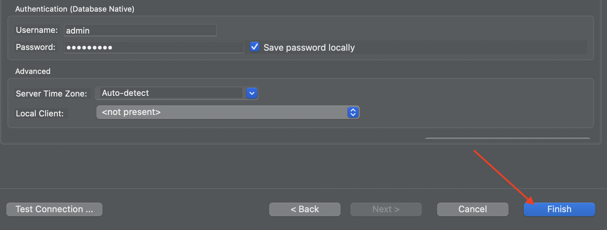
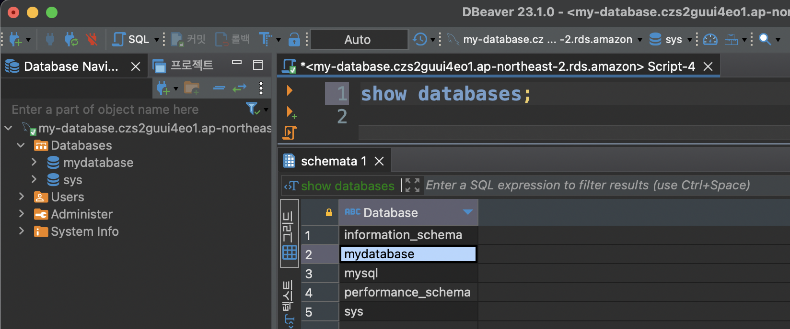

# DBeaver를 이용한 MySQL 접속 

---
### 단계1: 생성된 MySQL 클릭 

---
### 단계2: Endpoint 복사

---
### 단계3: DBeaver > 커넥션 생성 

---
### 단계4: DBeaver > MySQL 접속정보 입력 

---
### 단계5: DBeaver > MySQL 접속 테스트 성공

---
### 단계6: finish(생성)

---
### 단계7: show databases

