### 단계1: ec2 접속 
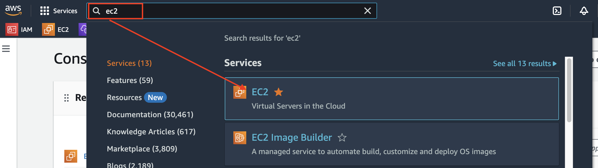

---
### 단계2: Launch Instance
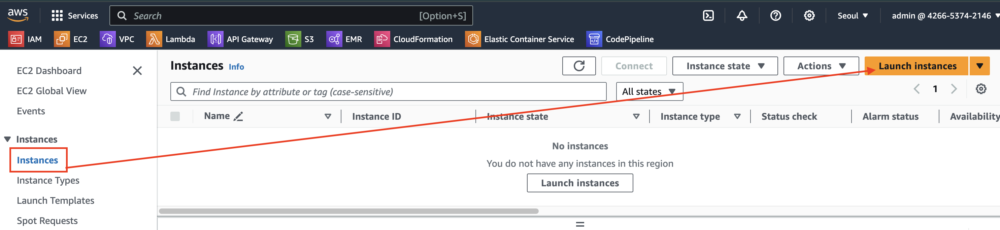

---
### 단계3: Namge and tags
> 생성될 인스턴스 이름

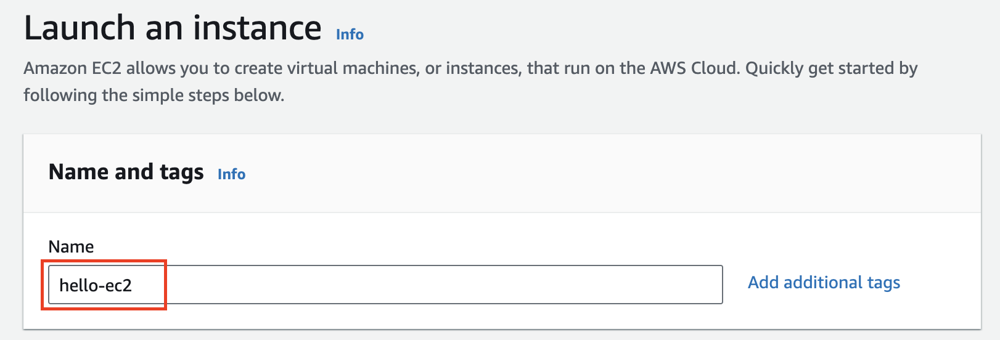

---
### 단계4: Application and OS Images
> 생성될 인스턴스에 설치될 OS

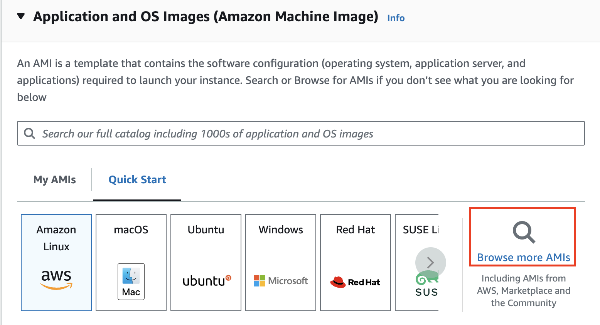

---
- select Ubuntu Server 

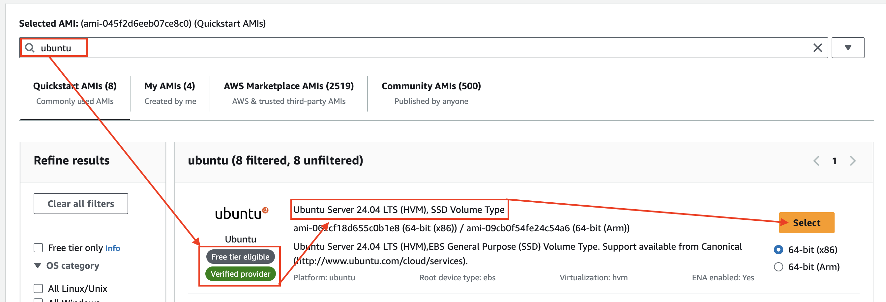

---
- 결과 확인 

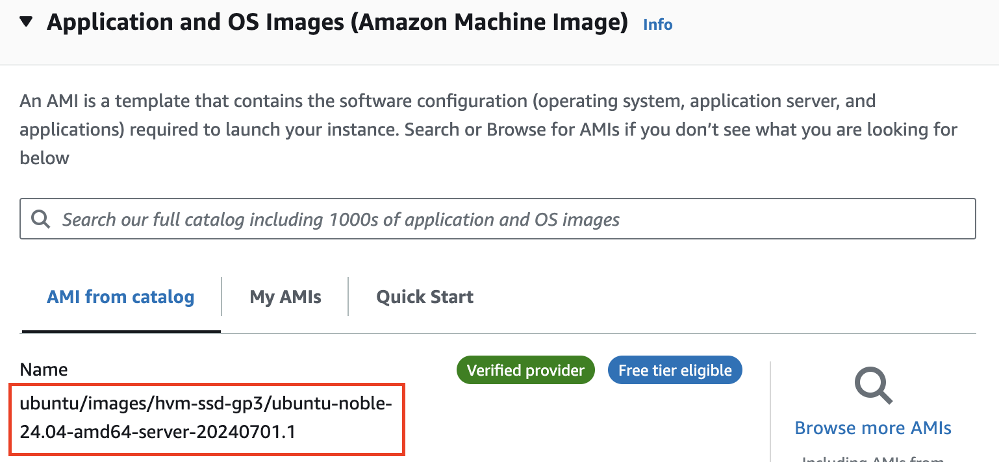

---
### 단계5: Instance type
> 생성될 인스턴스의 스펙(CPU & RAM 등) 

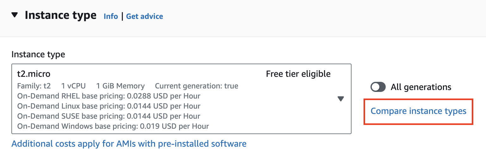

---
- `t2.micro`: 무료 인스턴스(컴퓨터)

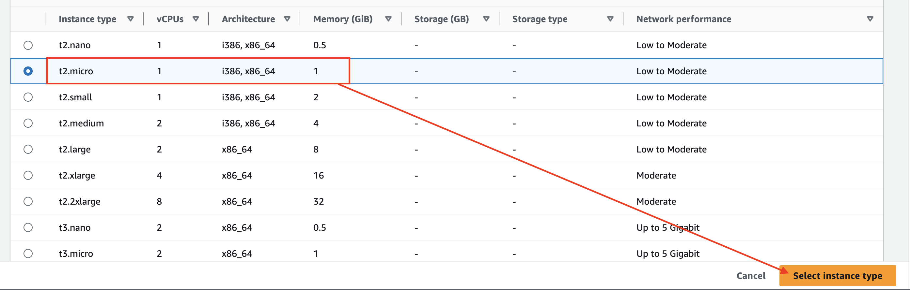

---
### 단계6: Key pair
> 생성될 인스턴스에 접속할 열쇠

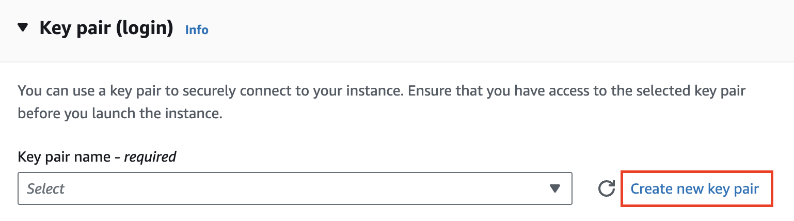

---
- Create key pair

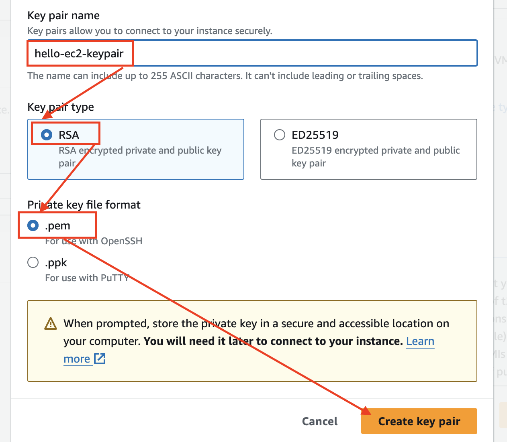

---
- 생성된 key pair로 세팅됨 

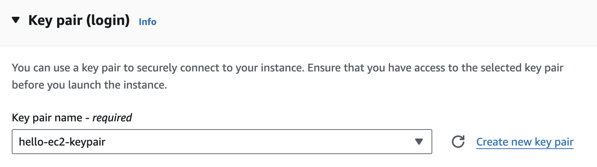

---
- 다운로드된 파일 확인 

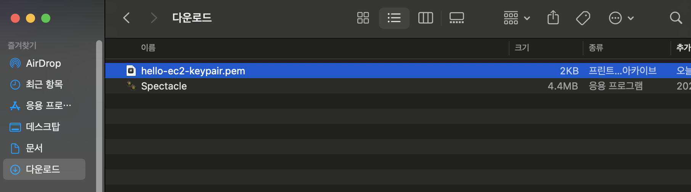

---
### 단계7: Network settings
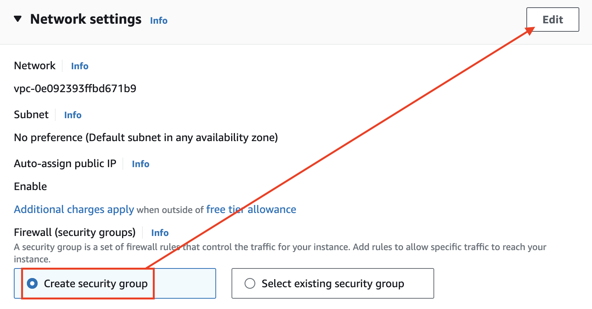

---
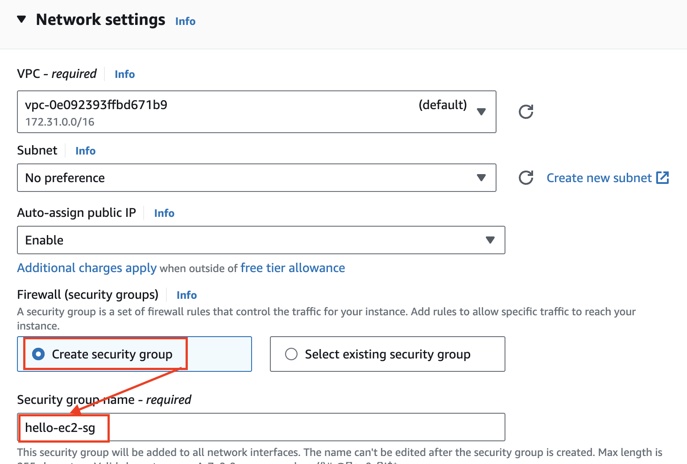

---
- `Inbound Security Group Rules`: ssh 확인  

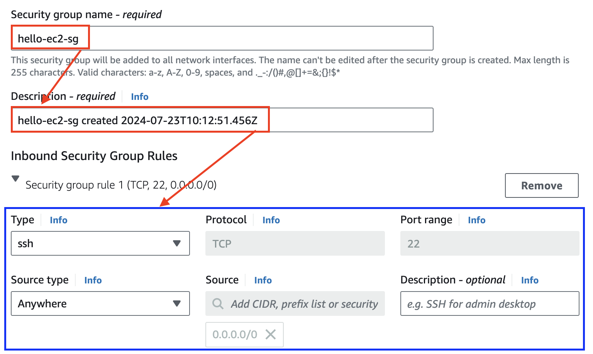

---
### 단계8: Configure storage & Launch instance
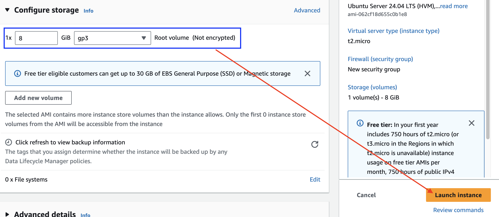

---
### 단계9: 생성된 인스턴스 및 Running 상태 확인 

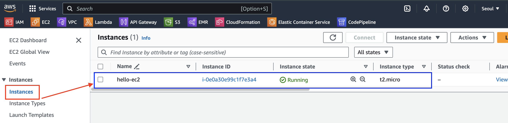
