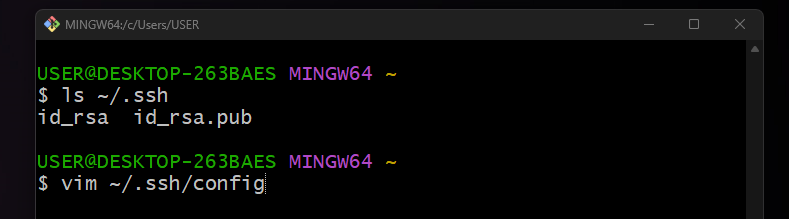
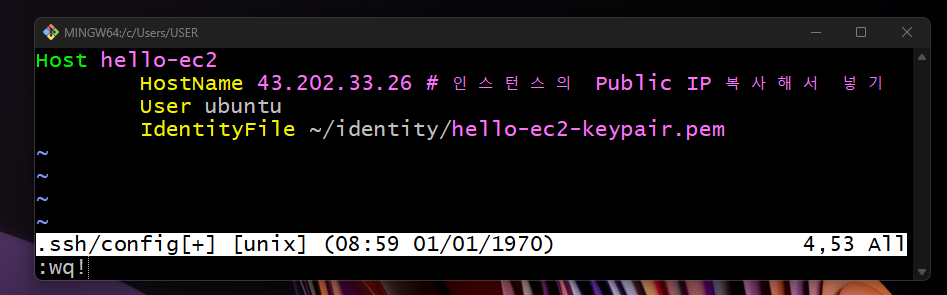
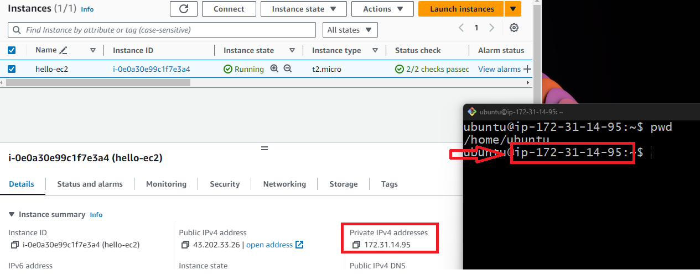

# Git Bash 접속 방법 

---
### 단계1: Git Bash 열기 


---
### 단계2: identity 폴더 생성 
```shell
mkdir -p ~/identity # 폴더 생성
ls ~/identity # 폴더 확인 
```


---
### 단계3: key pair 파일 확인  
```shell
ls ~/Downloads/*.pem 
```


---
### 단계4: key pair 파일 이동  
```shell
# 파일 이동 
mv ~/Downloads/hello-ec2-keypair.pem ~/identity/hello-ec2-keypair.pem
# 결과 확인 
ls ~/identity
```


---
### 단계5: (윈도우 생략) 권한 변경   
```shell
# pem 키 권한 변경 -> 600이 아닐 경우 보안 취약으로 판단
chmod 600 ~/identity/hello-ec2-keypair.pem
```


---
### 단계6: 인스턴스 Public IP 복사
- 인스턴스 Public IP는 서버를 stop할때마다 변경됨!!


---
### 단계7: ssh key 만들기
```shell
ssh-keygen -t rsa
# enter 세 번 탁! 탁! 탁!
```


---
### 단계8: ssh config 생성
```shell
# ssh key 확인
ls ~/.ssh
# ssh config 생성 및 작성
vim ~/.ssh/config
```


---
### 단계9: ssh config 작성 후 저장
```shell
# 아래 내용 추가 후 저장
Host hello-ec2
        HostName 43.202.33.26 # 인스턴스의 Public IP 복사해서 넣기 
        User ubuntu
        IdentityFile ~/identity/hello-ec2-keypair.pem
```


---
### 단계10: ssh config 생성
```shell
# ssh config 확인
ls ~/.ssh
# config 파일 권한 수정
chmod 440 ~/.ssh/config
```


---
### 단계11: hello-ec2 접속 
```shell
# hello-ec2 접속
ssh hello-ec2
# 진짜 연결하시겠습니까? yes 입력 후 Enter
Are you sure you want to continue connecting (yes/no/[fingerprint])? yes
```


---
### 단계12: hello-ec2 접속 확인 
- Private IP와 Git Bash에 표시된 IP가 같은지 확인 



---
### 단계13: 접속 종료 
```shell
exit
```

