### 단계1: ssh config 존재해야 함 
- 참고문서: `ec2 접속 - Git Bash`

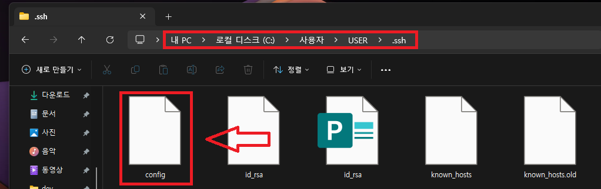

---
### 단계2: Extensions 설치 
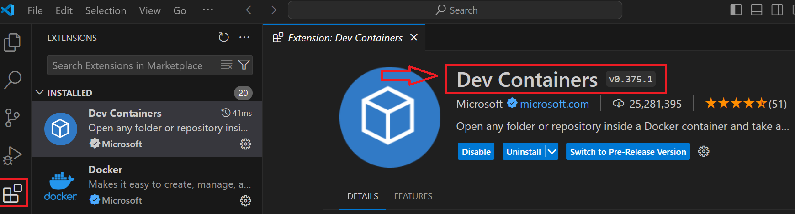

---
### 단계3: Connect to Host
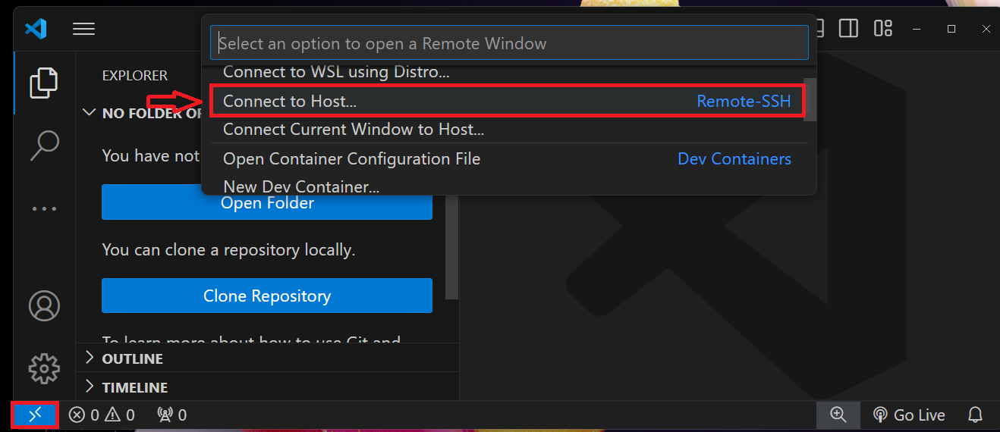

---
### 단계4: 접속할 Host 선택 
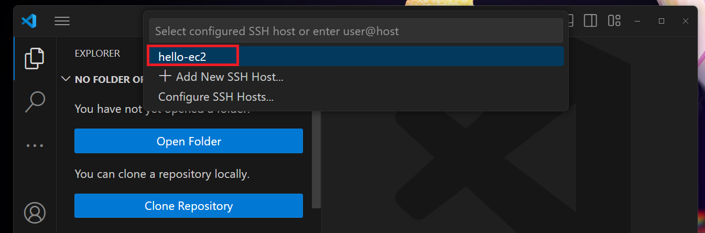

---
### 단계5: OS 선택 > Linux 
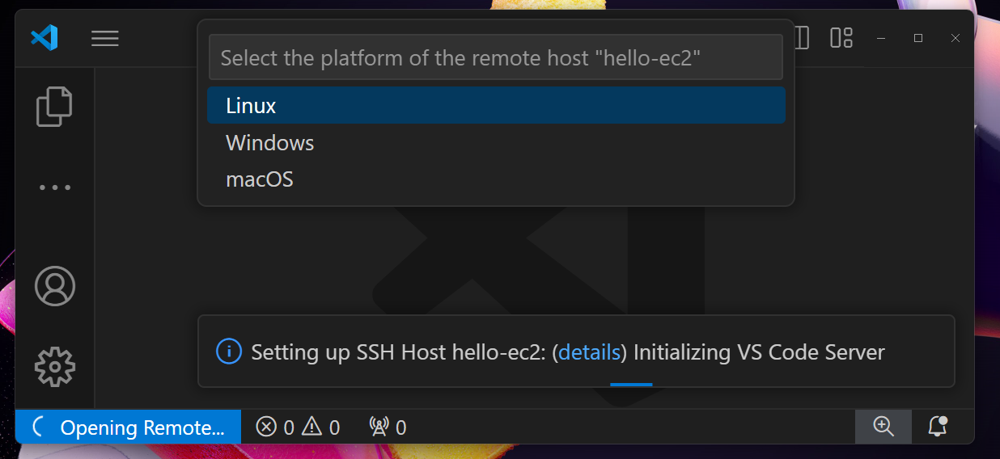

---
### 단계6: hello-ec2 접속 성공  
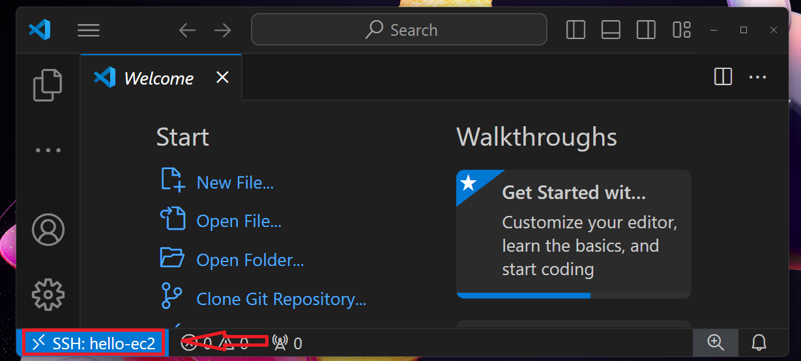

---
### 단계7: home 디렉토리 접속 
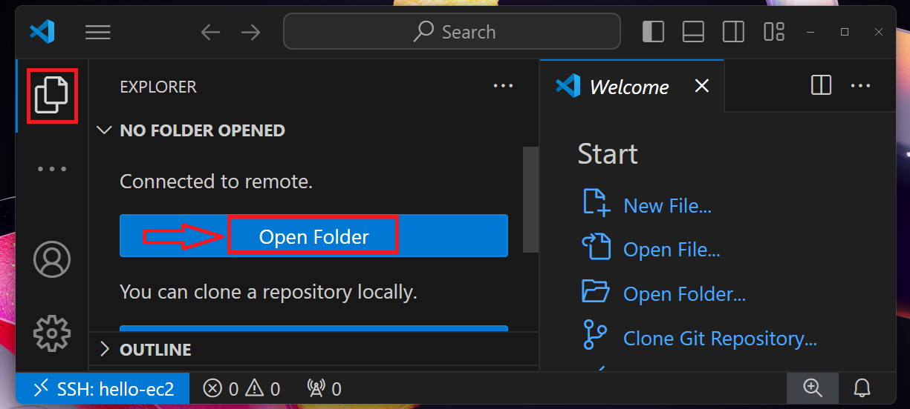

---
### 단계8: home 디렉토리 선택
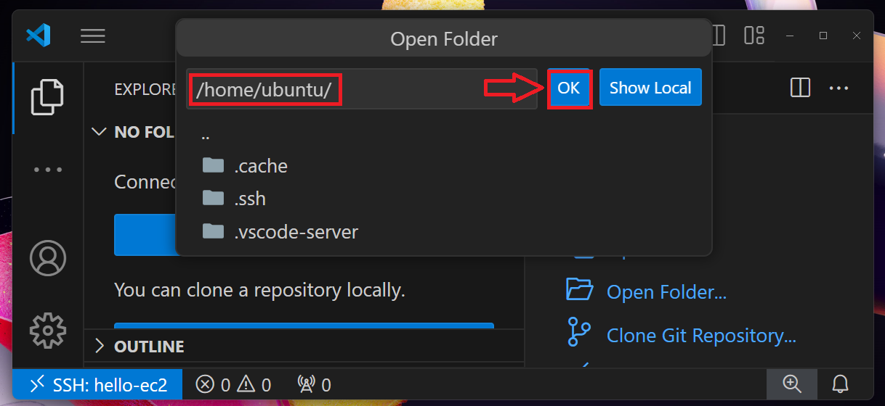

---
### 단계9: Yes, I trust the authors
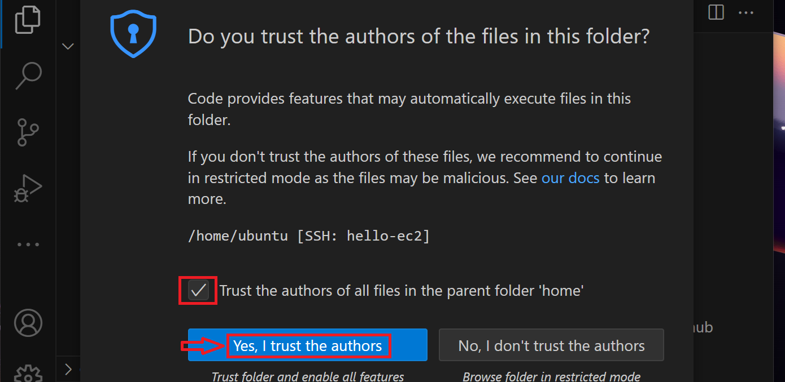

---
### 단계10: IP 확인 
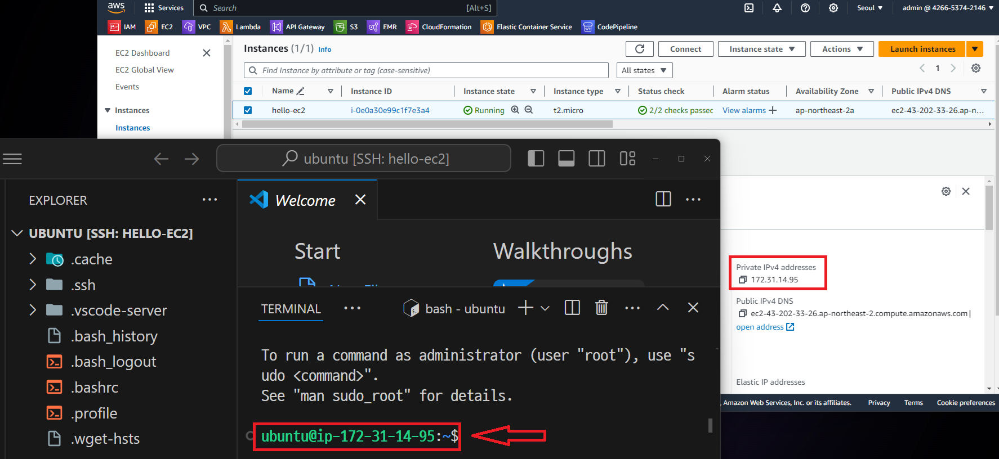

---
### 단계11: 접속 종료  
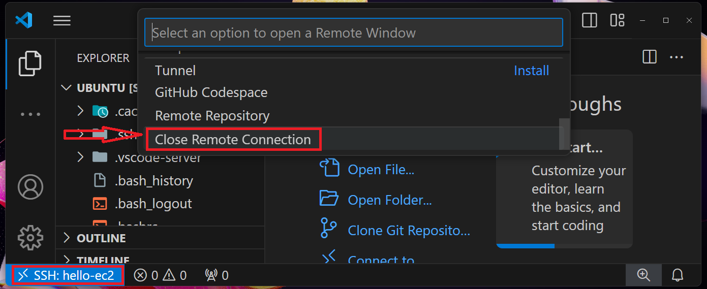

