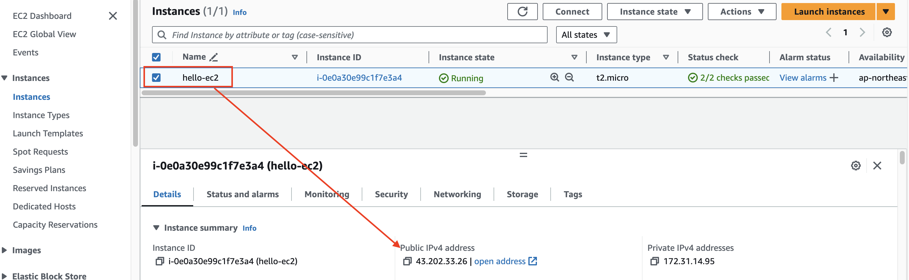
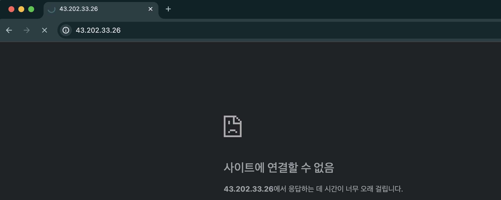

# Security Group 확인

---
### 단계1: Instance의 Security Group 확인 


---
### 단계2: Inbound rules 확인
- 외부에서 내부(ec2)에 접속할 수 있는 Rule 정의 


---
### 단계3: Outbound rules 확인 
- 내부(ec2)에서 외부로 접속할 수 있는 Rule 정의


---
# Nginx 접속 테스트 

---
### 단계1: ec2 접속
```shell
ssh hello-ec2
```


---
### 단계2: update
```shell
sudo apt-get update
```


---
### 단계3: install nginx
```shell
sudo apt-get install nginx -y
```


---
### 단계4: nginx server 실행 확인 
```shell
systemctl status nginx
```


---
### 단계5: Public IP 확인 


---
### 단계6: nginx 접속 실패 
- Public IP로 접속 시도 



---
### 단계7: Inbound rules 변경 


---
- 예제: http 프로토콜 & Apache Tomcat Server 추가 
- Nginx Server Port: `80`


---
- 변경 내용 확인 


---
### 단계8: nginx 접속 성공 
- Public IP로 접속 시도 


