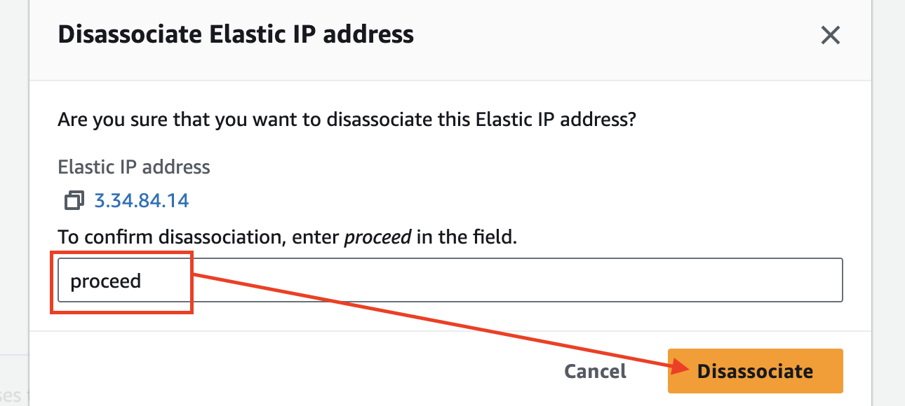

# EC2 Instance의 Public IP
- Instance를 재기동할때 마다 Public IP가 변경된다.

---
### 단계1: Public IP 확인 

---
### 단계2: Instance Stop

---

---
### 단계3: Instance Stopped > Public IP 없음  

---
### 단계4: Instace Start

---
### 단계5: Public IP 확인 
- 기존 Public IP와 값이 다름 

---
# [Elastic IP](https://docs.aws.amazon.com/ko_kr/AWSEC2/latest/UserGuide/elastic-ip-addresses-eip.html)
- Elastic IP 주소는 동적 클라우드 컴퓨팅을 위해 고안된 정적 IPv4 주소입니다. 
- [Elastic IP 요금](https://docs.aws.amazon.com/ko_kr/AWSEC2/latest/UserGuide/elastic-ip-addresses-eip.html#eip-pricing)

---
### 단계1: Allocate Elastic IP address

---
- Allocate

---
- 생성 확인 

---
### 단계2: Associate elastic ip with ec2 instance

---
### 단계3: Associate
- ec2의 public ip에 elastic ip 연결

---
### 단계4: ec2 public ip
- 생성한 elastic ip가 ec2의 public ip와 같음 

---
### 단계5: ec2 stop
- ec2 stopped가 되었지만 public ip 존재함 

---
# Elastic IP 삭제 

---
### 단계1: Disassociate Elastic IP

---

---

---
### 단계2: 결과 확인 

---
### 단계3: Elastic IP 삭제 

---

---
- 결과 확인 

