# Django

---
### 단계1: 장고 프로젝트 생성 
```shell
# 장고 프로젝트로 이동 
cd django-server
# 장고 프로젝트 생성 
django-admin startproject config .
```
---
### 단계2: 장고 앱 생성 
```shell
# todolist app
python manage.py startapp todolist
# user app
python manage.py startapp user
```
- config/settings.py에 앱 설정 추가
```python
INSTALLED_APPS = [
    ...
    "todolist",
    "user"
]
```
---
### 단계3: templates 설정
- templates 폴더 및 html 파일 추가 

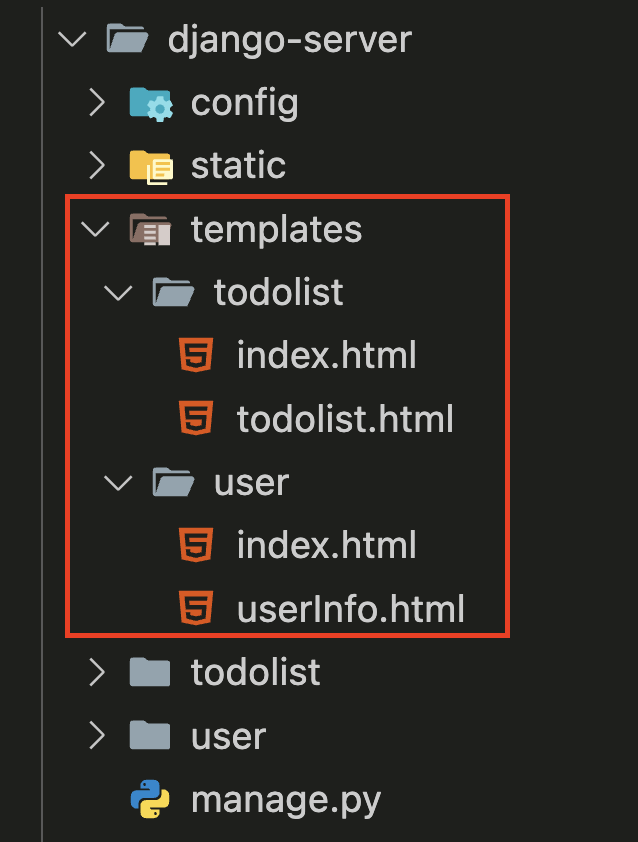

---
- config/settings.py에 templates path 설정 추가
```python
TEMPLATES = [
    {
        "BACKEND": "django.template.backends.django.DjangoTemplates",
        "DIRS": ["templates"],
        "APP_DIRS": True,
        "OPTIONS": {
            ...
        },
    },
]
```
---
### 단계4: static 설정
- static 폴더 및 css & js 파일 추가 

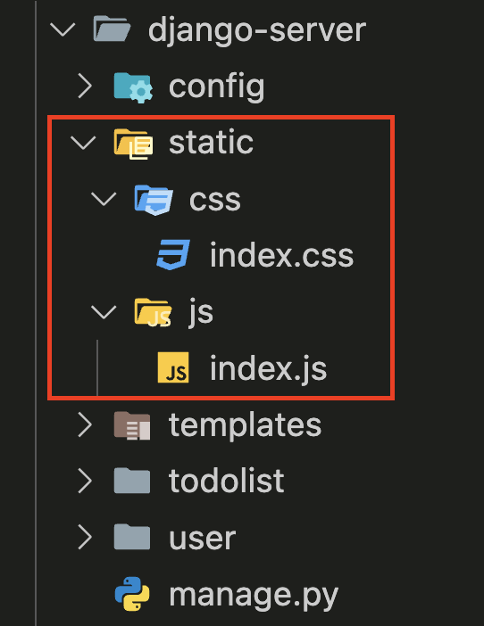

---
- config/settings.py에 static path 설정 추가
```python
import os 

STATIC_ROOT = '/static/'
STATIC_URL = "static/"
STATIC_PATH = os.path.join(
    BASE_DIR, "static"
)

STATICFILES_DIRS = (STATIC_PATH,)
```
---
### 단계5: user app 
- views.py
- urls.py

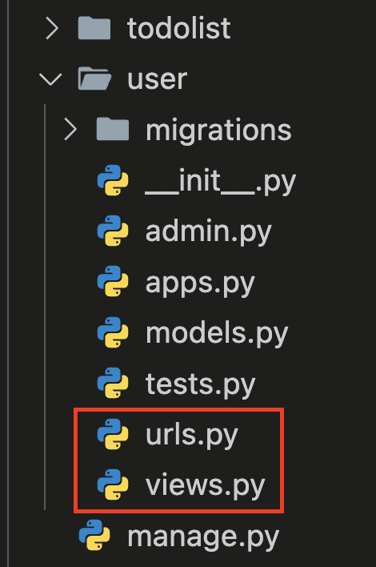

---
### 단계6: todolist app 
- views.py
- urls.py

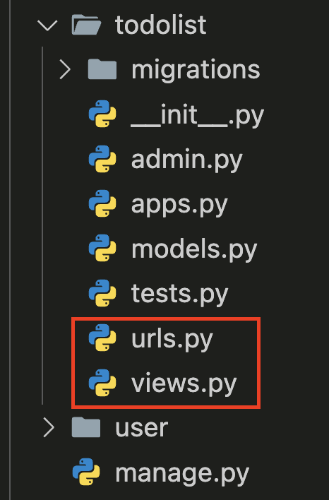

---
### 단계7: config.urls.py
```python
from django.urls import path, include

urlpatterns = [
    path("", include("todolist.urls")),
    path("user/", include("user.urls"))
]

```

---
# Bash Shell
- run.sh
```shell
#!/bin/sh

# Django ORM 적용 
python manage.py makemigrations
python manage.py migrate --no-input
# static( css & js ) 적용 
python manage.py collectstatic --no-input
# gunicorn을 이용한 django server 구동
gunicorn config.wsgi:application --bind 0.0.0.0:8000 &

# nginx 설정 적용 
unlink /etc/nginx/sites-enabled/default
# nginx 실행
nginx -g 'daemon off;'
```

---
# Dockerfile

```dockerfile
# python:[버전]-slim: 해당 이미지는 alpine linux를 기반으로 제작된 이미지인데 이 alpine 은 os 자체 용량이 매우 작음
# https://jadehan.tistory.com/58
FROM python:3.12-slim

# nginx 설치
RUN apt update && apt install nginx -y

# 파이썬 모듈 설치 
COPY requirements.txt requirements.txt
RUN pip install -r requirements.txt

...
```
---
```dockerfile
...

# Nginx 설정
COPY ./nginx/default.conf /etc/nginx/conf.d/default.conf

# Django server
COPY ./django-server /app
WORKDIR /app

# 환경변수 적용 
ENV SECRET_KEY 'django-insecure-yq9quc!!j!@^p-(ez^o%sb&-jxnq@z@)@di-unm14wp8smed9h'

# 실행 
COPY run.sh .
RUN chmod +x run.sh
CMD ["./run.sh"]
```

---
# Nginx 설정
```conf
# server: 어떤 서버가 http request 를 처리할지 설정한다.
server {
    # listen: port 를 설정한다.
    listen 80;
    # server_name 디렉티브는 하나의 IP 주소에 대해 여러개의 도메인(domains)을 사용할 수 있게 한다. 
    server_name 0.0.0.0;

    # root: request 의 root address 를 설정한다.
    root /app/static;
    ...
}
```

---
```conf
# server: 어떤 서버가 http request 를 처리할지 설정한다.
server {
    ...
    # location: request 의 URI 별로 requset 를 처리하는 설정을 한다.
    location /static/ {
        alias /app/static/;
    }

    # location: request 의 URI 별로 requset 를 처리하는 설정을 한다.
    location / {
        proxy_set_header Host $host;
        # proxy_pass: 해당 location request 를 proxy_pass server 와 매핑하여 해당 서버로 request 를 전달한다.
        proxy_pass http://0.0.0.0:8000;
        proxy_set_header X-Forwarded-For $proxy_add_x_forwarded_for;
    }

    # access_log: logging 파일을 설정한다. Logging 형식은 log_format 에서 정의한 main 형식으로 저장한다.
    access_log /var/log/nginx/access.log;
    # error_log: nginx logging 설정. log file 과 logging level 을 설정한다.
    error_log /var/log/nginx/error.log;

}
```
---
# Run Docker Container

---
### 단계1: Make docker image
- 명령어: `docker build --platform linux/amd64 -t [dockerhub 아이디]/[이미지명] .`
    - Mac M1에서는 꼭 `--platform linux/amd64` 추가해야함
```shell
docker build --platform linux/amd64 -t goodwon593/django-image .
```
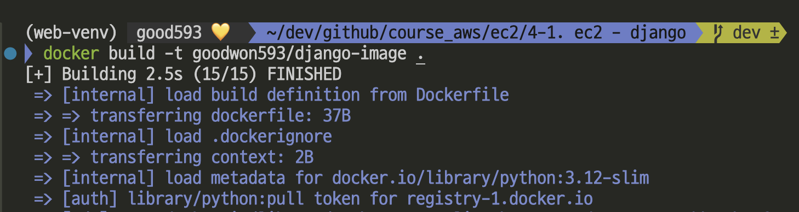

---
- 결과 확인 
```shell
docker images
```
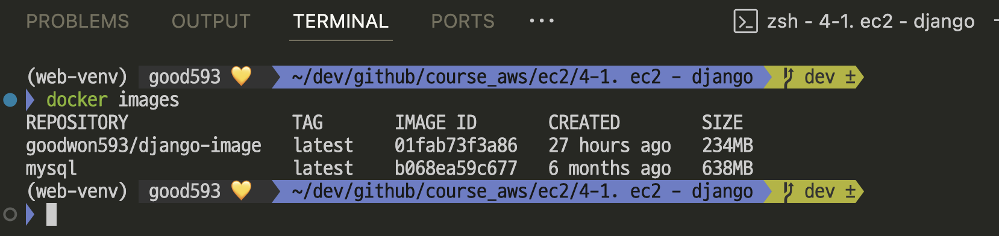

---
### 단계2: Create container
- 명령어: `docker run --name [컨테이너명] -d -p 80:80  [dockerhub 아이디]/[이미지명]`
```shell
# Create container
docker run --name django-container -d -p 80:80 goodwon593/django-image
# 결과 확인 
docker ps
```
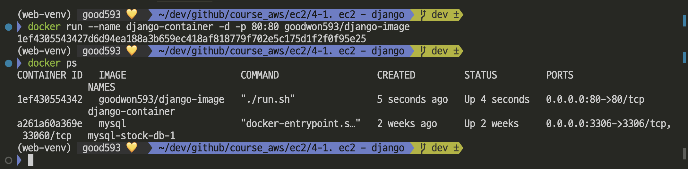

---
### 단계3: Django 접속 테스트
- `http://localhost:80/`

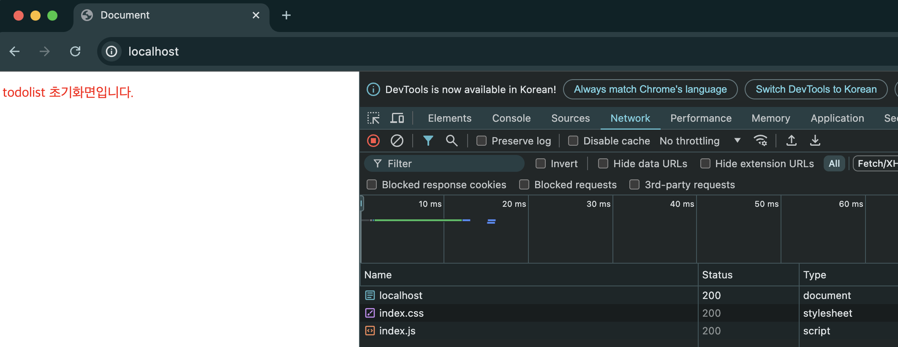

---
### 단계4: 컨테이너 삭제 
```shell
# 컨테이너 삭제 
docker rm -f django-container
# 결과 확인 
docker ps -a
```
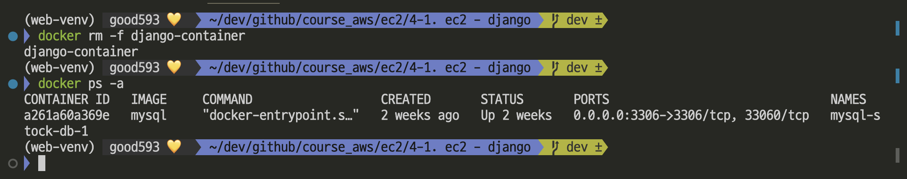

---
### 단계5: 도커 로그인 
```shell
docker login
```
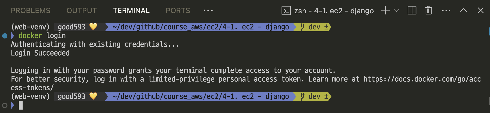

---
### 단계6: 도커허브로 이미지 업로드
```shell
docker push goodwon593/django-image
```
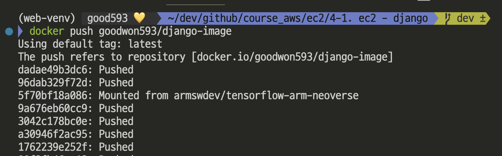

---
### 단계7: 도커허브에서 나의 이미지 조회
```shell
docker search goodwon593
```
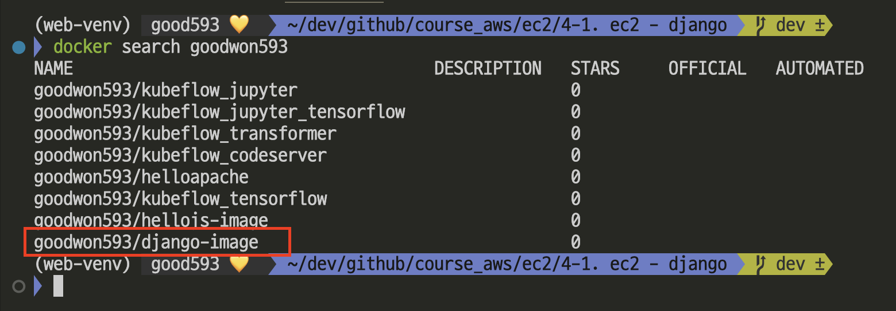

---
### 단계8: [도커허브](https://hub.docker.com/)
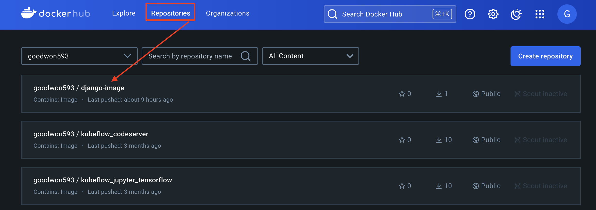

---
# 참고 문서
- https://www.youtube.com/watch?v=oCu3_JKsYYc
- https://github.com/dotja/django_CD_github_actions
