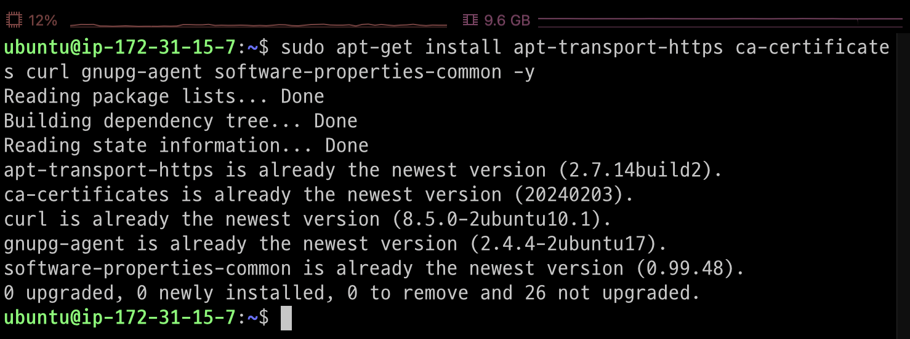
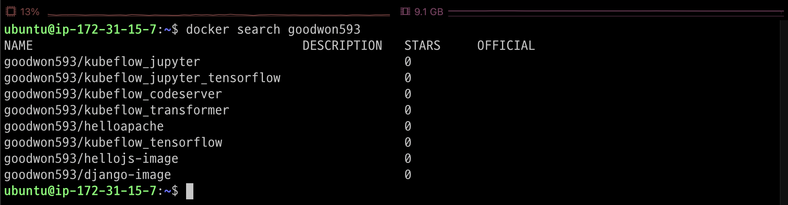

# aws ec2 생성

---
### 단계1: Launch instances


---
### 단계2: Instances name


---
### 단계3: Application and OS Images


---


---
### 단계4: Instance type 


---
### 단계5: Key pair 


---
### 단계6: Network settings


---


---
- ssh protocol


---
- nginx server, django server


---
### 단계7: configure storage & Launch instance


---
# ec2 접속 

---
### 단계1: Public IPv4 address


---
### 단계2: keypair 이동 


---
### 단계3: (윈도우 생략) 권한 변경   
```shell
# pem 키 권한 변경 -> 600이 아닐 경우 보안 취약으로 판단
chmod 600 ~/identity/django-keypair.pem
```


---
### 단계4: config 수정 
```shell
vim ~/.ssh/config
```


---
### 단계5: ec2 접속 by ssh


---
# docker in ec2 설치

---
### 단계1: 우분투 시스템 패키지 업데이트
```shell
sudo apt-get update
```


---
### 단계2: 우분투 시스템 패키지 업데이트
```shell
sudo apt-get install apt-transport-https ca-certificates curl gnupg-agent software-properties-common -y
```


---
### 단계3: Docker의 공식 GPG키를 추가
```shell
curl -fsSL https://download.docker.com/linux/ubuntu/gpg | sudo apt-key add -
```


---
### 단계4: Docker의 공식 apt 저장소를 추가
```shell
sudo add-apt-repository "deb [arch=amd64] https://download.docker.com/linux/ubuntu $(lsb_release -cs) stable"
```


---
### 단계5: 시스템 패키지 업데이트
```shell
sudo apt-get update
```


---
### 단계6: Docker 설치
```shell
sudo apt-get install docker-ce docker-ce-cli containerd.io -y
```


---
### 단계7: Docker 설치 확인 
```shell
sudo systemctl status docker
```


---
### 단계8: 권한 변경 
```shell
# 파일의 권한을 666으로 변경하여 그룹 내 다른 사용자도 접근 가능하게 변경
sudo chmod 666 /var/run/docker.sock
docker ps
```


---
# Django

---
### 단계1: search django image
```shell
docker search goodwon593
```


---
### 단계2: pull django image
```shell
docker pull goodwon593/django-image
```


---
### 단계3: django image 확인 
```shell
docker images
```


---
### 단계4: Create container
```shell
# Create container
docker run --name django-container -d -p 80:80 goodwon593/django-image
# 결과 확인 
docker ps
```


---
### 단계5: Public IPv4 address


---
### 단계6: Djagon 접속 on aws ec2


---
# 참고 문서 
- https://haengsin.tistory.com/128
- https://velog.io/@osk3856/Docker-Ubuntu-22.04-Docker-Installation


